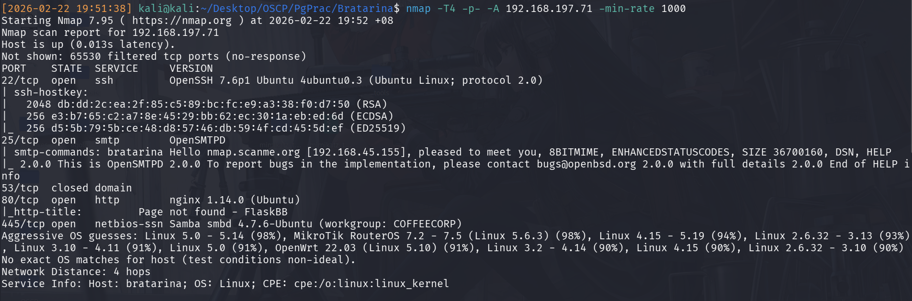
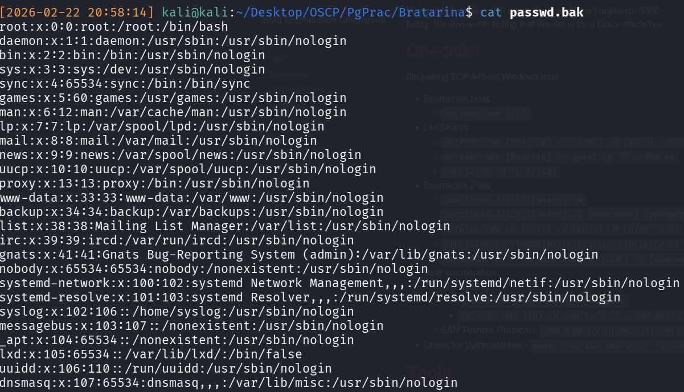
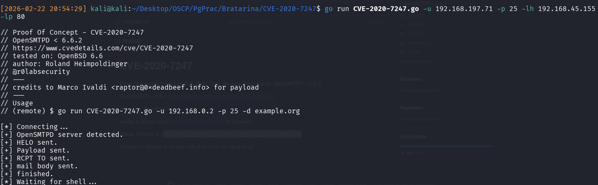
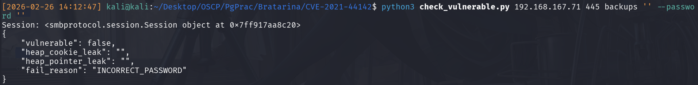

## Introduction
Following Lain Kusanagi's list, here's the writeup for Bratarina

## Enumeration
Following the nmap scan:

We can observe the following:

|Port|Service|Version|Feasibility|
|-----|------|------|-------|
|22|SSH|OpenSSH 7.6|No- *Can't be attempted without either a password or username*|
|25|SMTP|OpenSMTPD 2.0.0|Check this!|
|53|??|??|No- closed so unlikely|
|445|SMB|SMB 4.7.6|Check this!|

### SMB Enumeration
Listing out the SMB shares shows 2 Admin shares, and 1 publicly accessible `backups` share. Connecting and dumping it out yields a `passwd.bak`, which is an `/etc/passwd` backup file. 

Although it isn't too useful, we observe that there are only 2 users relevant to us:
- root
- www-data

A quick Google of (SMB 4.7.6 Vulnerabilities)[https://www.cvedetails.com/version/1416840/Samba-Samba-4.7.6.html] yields quite a few issues. However, given our position of needing initial access, we'll zoom in on code execution. Out of those, the viable one would be CVE-2021-44142, which coincidentally has a (Github Checker Script)[https://github.com/horizon3ai/CVE-2021-44142].

### SMTP Enumeration
There's 2 approaches we can take:
1. We can use `smtp-user-enum` and enumerate out possible users, and try to brute-force SSH our way into initial access. This should always be a last step resort because it's never a good idea in both an IRL engagement, and also in a CTF. **The security assumption would be that because it's a publicly accessible service, the defender would definitely use a unique username:password combination. Additionally, there would be IDS/Firewall services running which would prevent and log these brute-force attempts. This security assumption is hard to defeat, and can realistically only be attempted with a confidently known username/password.**
2. Checking for vulnerabilities in SMTP itself. With a google search for OpenSMTPD 2.0.0 vulnerabilties, we discover quite a few, and eventually will find that there's (CVE-2020-7247)[https://github.com/r0lh/CVE-2020-7247],a remote code execution vulnerability. 

### Initial Access
Utilising the found exploit for CVE-2020-7247, we can successfully gain a shell and get the flag.

### Other Methods
Attempting CVE-2021-44142, we receive an authentication failure.

Examining the code, it has likely to do with the share not using the vulnerable VFS module, and therefore, it's unsuccessful. 