## Introduction
Following on Lain Kusanagi's list, here's the writeup for Cockpit.

## Enumeration
I ran the usual nmap scan command `nmap -T4 -p- -A 192.168.186.10 -min-rate 1000`


I use `-min-rate 1000` to make the nmap scan faster. However, it's important to understand that during the OSCP, it might be a better idea to not include that flag because you want to **prioritise comprehensiveness over speed**. I use this because it's the command I copy and paste for the HTB seasonal boxes!


From the nmap results, we can see that:
|Port|Service|Feasibility|
|-----|-----|-----|
|22|SSH 8.2|No|
|80|HTTP|Yes|
|9090|HTTP|Yes|

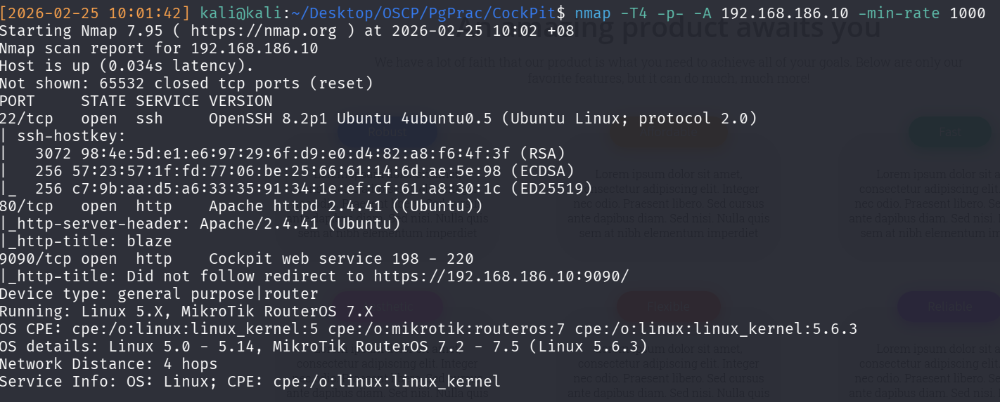

Therefore, the only logical plan of attack would be the two web pages on 80 and 9090. Attempting a brute-force attack on SSH is pointless due to lacking knowledge of any credentials.

Accessing the webpage on port 80 shows a shopping-themed website.
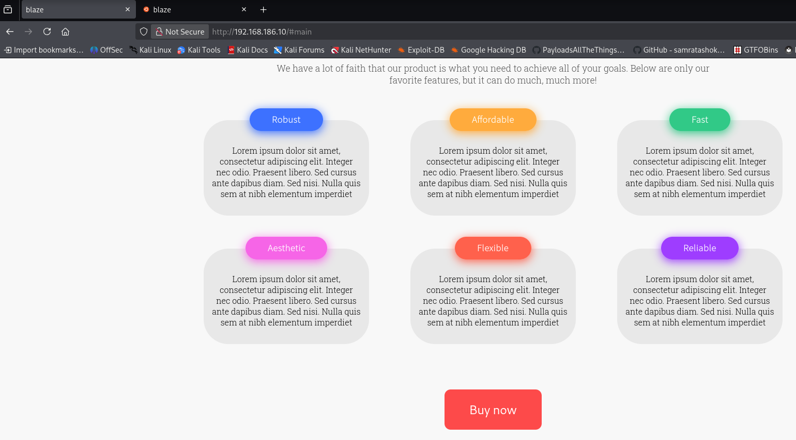

Accessing the webpage on port 9090 shows a login screen.
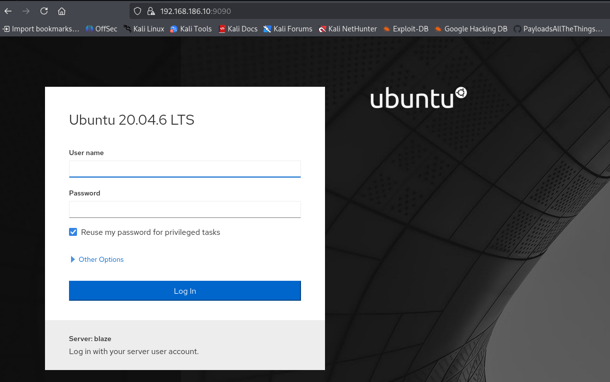

Therefore, we now have a couple more things to do:
- Finding out the type of website on port 9090
- Finding out the type of website on port 80
- Finding out the language of website on port 80
- Finding any directories on port 80
- Finding any directories on port 9090

### Port 9090 Enumeration
Enumerating port 9090 first, we realise that it's a Cockpit Webapp. Note the awkward phrasing used, it's because I didn't do any forced directory enumeration, I simply did `curl -I http://192.168.186.10:9090` to grab the headers of the site, and saw Cockpit in the response.

Further research shows that cockpit is a [web-based GUI for remote server management](https://cockpit-project.org/). Unfortunately, there do not seem to be default credentials, and trying `admin:admin` does not work. A specific version cannot be fingerprinted too, so any cockpit exploitation can be shoved to the end of our enumeration list for now. 

### Port 80 Enumeration
Enumerating port 80 next, checking the Wappalyzer plugin, I can see that it's a PHP site. 


Note that wappalyzer determines this based on plugins, scripts etc that are run on the site. Therefore, some interaction with the site and constant checking might be needed

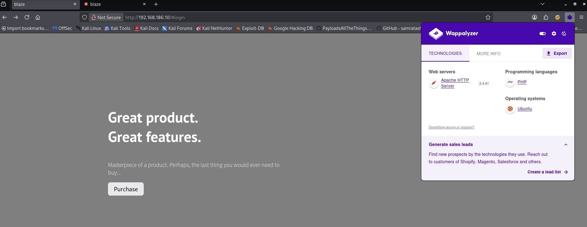

Therefore, our forced directory command can become `feroxbuster -u http://192.168.186.10 -w /usr/share/wordlists/seclists/Discovery/Web-Content/raft-large-directories.txt --threads 100`


I use `--threads 100` to make it faster, and based from my experience, it's accurate enough


From there, as shown in Figure 5 below, we can notice a `login.php`/`logout.php`
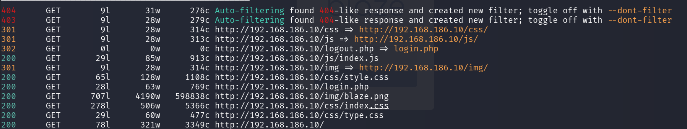

And visiting that page shows a Login screen:
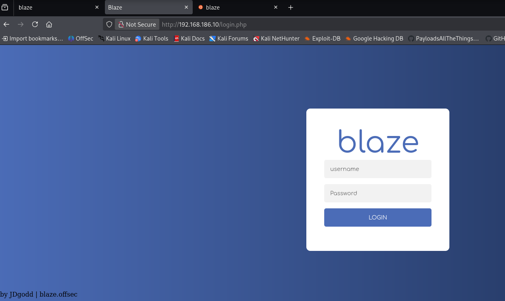

Snooping around the page, we're unable to find anything related to CMS/Versions. Additionally, given the footer `by JDgodd`, a good guess to hazard is that this site is custom-made.
**Therefore, instead of focusing on CVE's, it's a good idea to focus on WebApp related attacks. In this case, SQL injection.**

## Initial Access
Intercepting the request in Burp, we observe that there's a `username` and `password` parameter in request body.
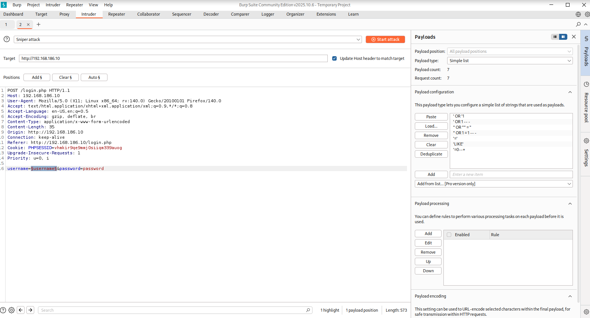

Therefore, utilising [SwissSkyRepo's SQLInjectionPayloads](https://github.com/swisskyrepo/PayloadsAllTheThings/blob/master/SQL%20Injection/MySQL%20Injection.md#mysql-testing-injection), choose the first parameter and start the intruder attack.


We do not attack the second parameter `password` because with 2 parameters, we aim to nullify the second parameter (via comments) to reduce the total checks from 2 to 1


Viewing the intruder results, we notice successful payloads starting with `'`
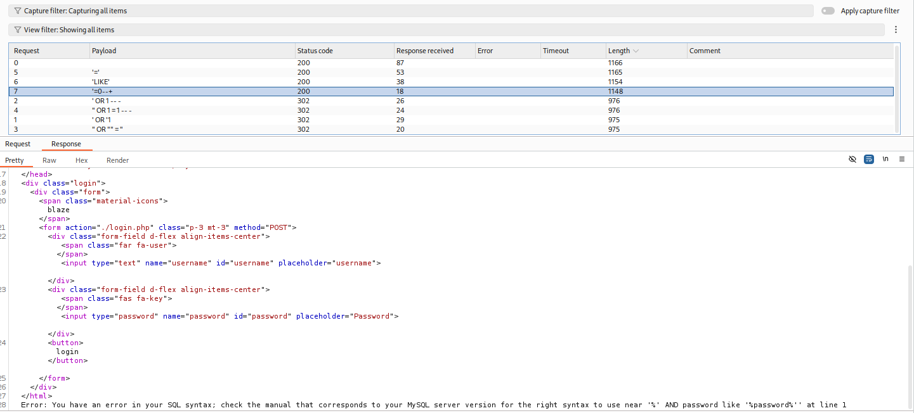

SQL Injections can be broken down into 4 phases:
1) Identify Vulnerable SQL Injection statement
2) Enumerate number of columns present in table using `ORDER BY` or `UNION SELECT`
3) Enumerate number of *displayed columns* present on frontend
4) Leak info from other tables with `UNION SELECT`

We've already accomplished step 1. 
Moving on to step 2, just `UNION SELECT NULL` incrementally and eventually, it'll be 5 nulls before an error occurs. This means that there are 5 columns present in the table.

In step 3, just replace the `NULLS` with unique integers for identification. We can see that col 2 is the only col where data is displayed on the frontend.
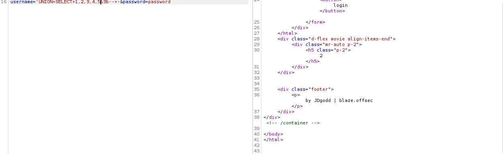

Therefore, we can start dumping information about the DB, for example, version:
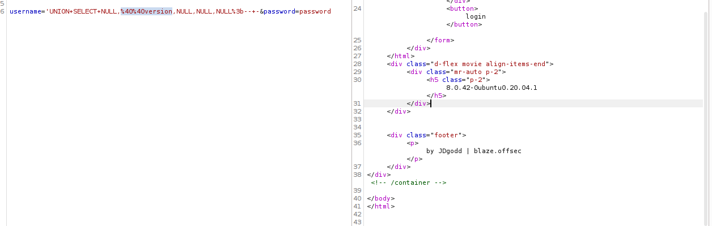

After that, sequentially dump out DATABASE, TABLE, COLUMNS, and eventually DATA to get the admin password:
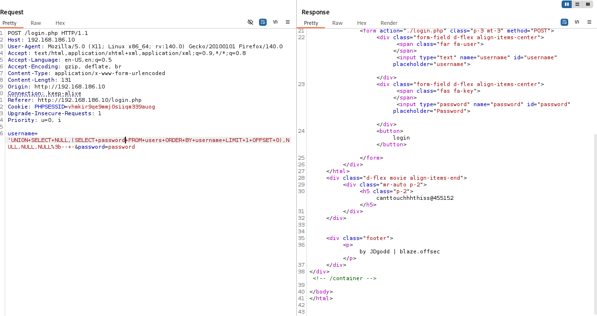

There's only 1 row inside the `users` table luckily!

Utilising the found credentials, we can login to the system and see `james` and `cameron`, along with some hash. 
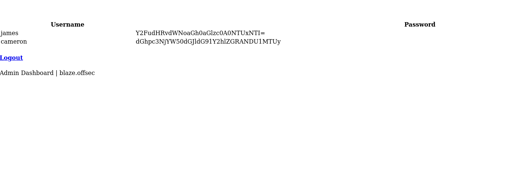

**It's important to know that academically, these are Base64 encoded strings and NOT HASHES. This distinction is important because hashing is a one-way process involving an input string being sent into a function and resulting in irreversible output. Base64 encoding can be encoded and decoded (reversed) via websites like CyberChef, and is therefore, not hashing! We can identify these to be base64 encoded because of the `=` at the end.**

After decoding it, we can get `james` and `cameron` passwords of `canttouchhhthiss@455152` and `thisscanttbetouchedd@455152`.

Attempting SSH with those known credentials did not work
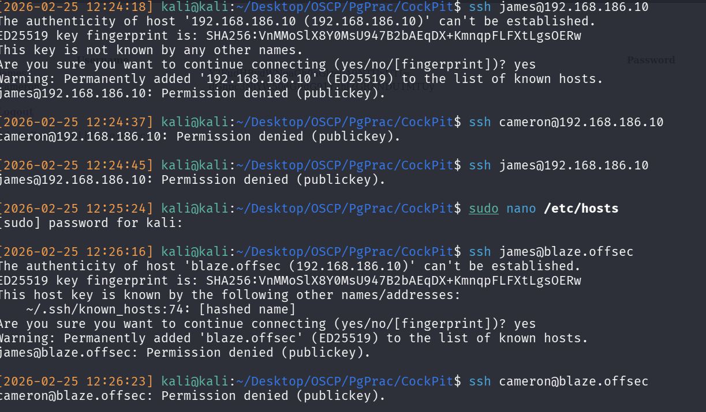

Therefore, going back to the Cockpit login screen, we try those creds, and can enter in as james!
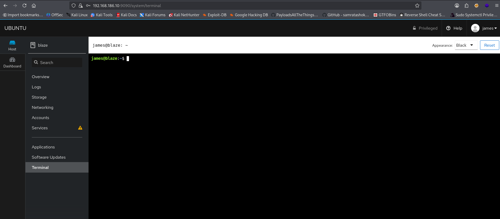
As seen from the screenshot, after clicking around for a bit we can see a web-console has a terminal session directly into the system. It has python, so we can just use a python reverse shell and catch the listener on our local kali for easier enumeration.

I used one from [RevShells](https://www.revshells.com/)
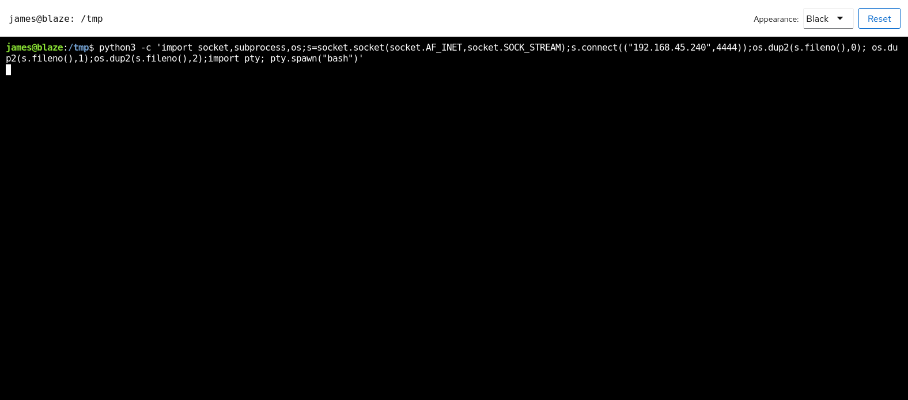

We now have initial access!

## Privilege Escalation
Running `linpeas_fat.sh` on the victim, along with a few more enumeration steps, we notice a few things:

1) `sudo -l` shows `tar .... *`
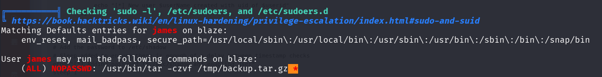

2) CVE-2021-3560 
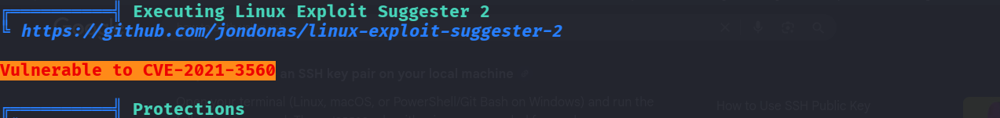

Unfortunately, CVE-2021-3560 is unable to be used because it requires us to ssh in as the user, which cannot be done. 

Therefore, the correct path is the sudo privesc route. Conceptually, it's simple. This is known as path-globbing due to lax wildcard expansions which Linux has. Specifically, since it's run with a wildcard (*), and if we have write permissions in said directory, we can write files which have the same names as flags for the command. 
Normally, `*` is replaced with a list of filenames in the current directory.
As a result, when the command is run, Linux will treat these files as the flags and run them, and if the binary supports code execution, we can create a remote shell/add ourselves to sudoers. Alternatively, if it only supports file reading, we can use it to dump out files to `/tmp`.

You can read more details in the privesc section of my checklist, but `tar` allows for code-execution via `--checkpoint-action`


So therefore, it's just:


echo "" > '--checkpoint=1'
echo "" > '--checkpoint-action=exec=sh privesc.sh'

# Create a privesc.sh containing the user to add to sudoers, in this case, james
echo 'james ALL=(root) NOPASSWD: ALL' > /etc/sudoers

# Alternatively, use it to reverse shell


And you're done!