## Introduction
Following Lain Kusanagi's OSCP prep list, here we are at Extplorer.

## Enumeration
The first step as per normal is to run the nmap scan: `nmap -T4 -p- -A 192.168.186.16 -oN nmap.txt`. Although I miss out on the output most of the time, it's a good idea for compliance and also to back-reference in case you want to write reports.

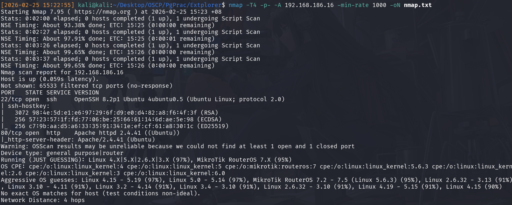

From the Nmap scan we can see that the following ports are open:

|Port|Service|Feasibility?|
|-----|-----|-----|
|22|OpenSSH 8.2.1|No|
|80|HTTP|Yes|


It's important to remember that regreSSHion(CVE-2024-6387) **only works for OpenSSH versions 8.5p1 to 9.7p1**. There's some minor differences regarding to distro type, but it's inconsequential. 


Therefore, without any credentials, it's pointless to attack SSH via brute force, so our only option is to check the HTTP site.

Visiting the HTTP site shows a Wordpress config page.
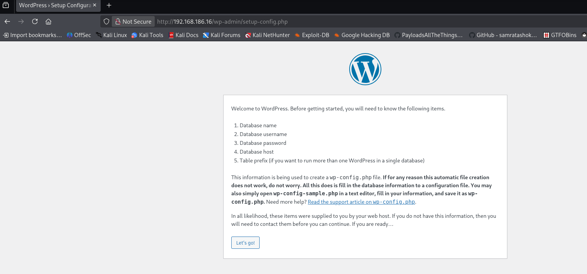

Normally the approach when encountering a wordpress CMS would be to head straight to the `/admin` page and attempt a login using default credentials, or enumerating wordpress version/themes/plugin versions manually via visiting the appropriate directory/checking the `.js` files, or just using `wpscan` and using the toilet while it runs. 

However, for this case, given that it's a config page, it's a reasonably assumption to guess that this hasn't even been configured, and you can double check this assumption via visiting the `/login` page yourself to see it redirect back. Hence, this is unlikely an attack vector. 

As a result, when unsure, just do forced directory browsing to get as much information as possible.

`feroxbuster -u http://192.168.186.16 -x php -w /usr/share/wordlists/seclists/Discovery/Web-Content/raft-large-directories.txt --threads 100`


We know it's PHP because it's a wordpress site!


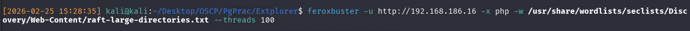

Once it done, we can scroll through the results and see successful request to `/filemanager`

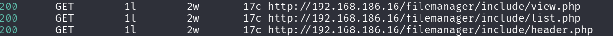

And therefore, visiting the base of `filemanager` throws up a HTTP page for eXtplorer, which either after a quick google search or just an educated guess, is a web-application file-storage, similar to [DUFS](https://github.com/sigoden/dufs) or [FileGator](https://github.com/filegator/filegator).

*I'm hesitant to use the term object-storage since it generally refers to storing information beyond files and these data blobs are often indexed in some form, which is not the case here.*

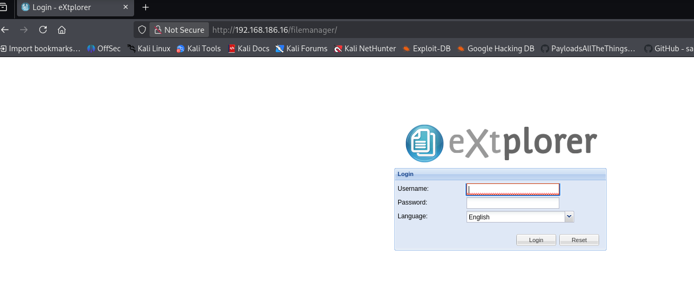

As can be seen, we're met with a login page. You definitely should google for ExtPlorer default credentials before trying anything because there could be an IDS which logs failed authentication attempts and potentially lock you out via an IP ban. However, I just threw the usual `admin:admin` inside and managed to log in.

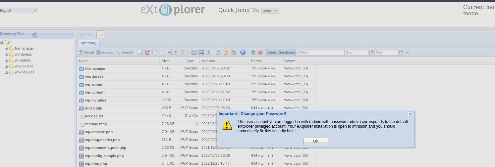

Now the aim is to identify what version of extplorer this is. If you google this, you'll be told that there's a config file. I unfortunately did not google and just immediately clicked around the `/filemanager` directory, and found it at the top 

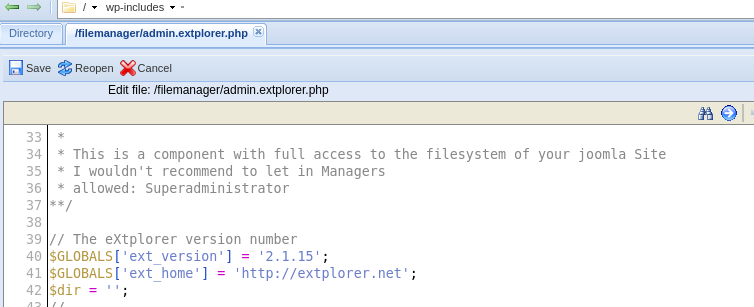

If you google `extplorer 2.1.15 vulnerabilities` you'll find an entry for [CVE-2023-29657](https://nvd.nist.gov/vuln/detail/CVE-2023-29657), which states that zip files can be uploaded containing PHP pages for RCE, however, visiting the referenced blog post shows that it's been deleted. 

In this kind of scenario, just use wayback machine and visit the last-cached version of the site to read the details. Alternatively, you can try to exploit it manually. In this scenario, I tried to exploit it manually since I'm experienced with the general workflow. The idea is to either upload a web-shell or reverse-shell into a publicly accessible directory. From there, visit that directory and execute the uploaded file. It's pretty simple!

Therefore, we now have 2 things todo:
1) Identify publicly accessible directory
2) Upload shell to said accessible directory

## Intial Access
I usually choose `images` directories, because these are guaranteed to be publicly accessible since the security assumption is that images need to be served publicly, and it's simpler to just make this publicly accessible and fetch from there rather than writing an entire endpoint to securely fetch. Hence, they'll have fewer protections too (if any) since it's assumed to be unable to access them in the first place. 

I settled on `wp-admin/images` as a result (since we could visit `wp-admin` at the start.)

The instructions state to just zip a shell, unzip and visit. Likewise, I copied the `php-reverse-shell.php` from `laudanum` on Kali, zipped manually, uploaded, unzipped into `/images` and visited it!


laudanum

cp php-reverse-shell.php /home/kali/Desktop/extplorer/rev.php 

--Edit rev.php for listener IP+ Port--
--zip, upload and done!--


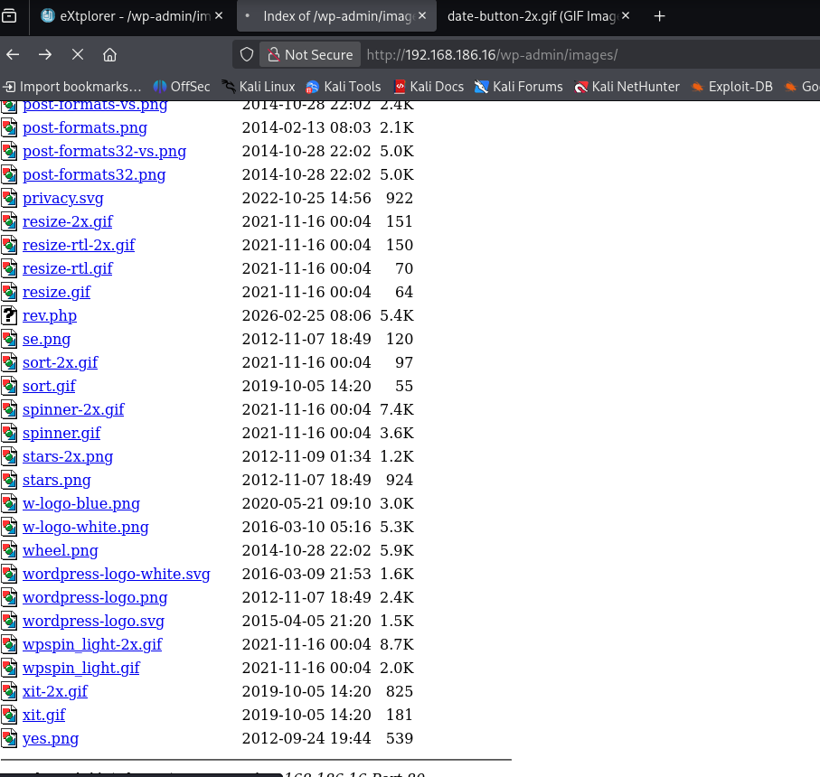

Setting up the nc listener with `nc -lvnp 4444`, we can catch the shell.

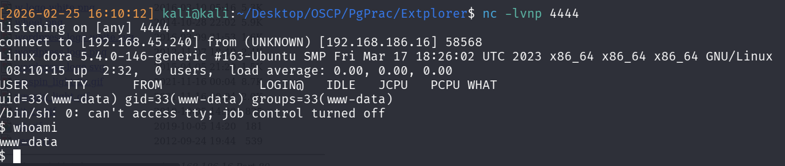

As seen, we landed inside as `www-data`. Checking `/etc/passwd`, we can see 2 other relevant users, `dora` and `root`. We can therefore set our short-term goal to first, become dora!

## Privilege Escalation- Dora
To either `su -u dora` or `ssh dora@192.168.186.16`, we'll need her password. **If uncertain, just run linpeas. Linpeas has a checker inside for files which have config/password in the name.** However, to take a more nuanced approach, I decided to first google if ExtPlorer had a config/DB file which I could use to see if there were any other passwords beyond `admin:admin`. A quick google search and the AI Overview throws out the answer `/config/htusers.php`, and it even tells us its `bcrypt` or `blowfish` hash format.

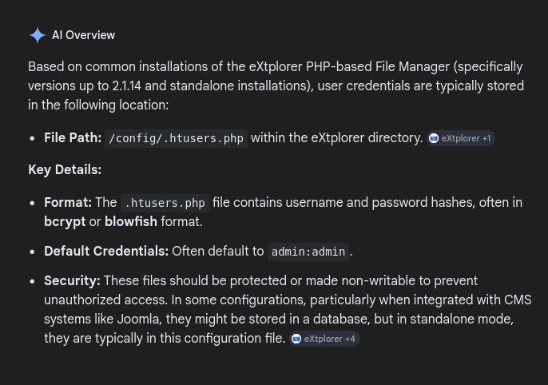

Therefore, I made my way there and found the appropriate hashes for `admin` and `dora`.
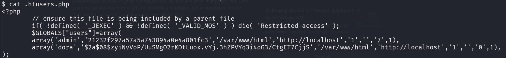

Copying and pasting dora's hash locally, first use `hashid` to confirm the hash-type (to be blowfish). After that, use hashcat with module `3200` to get the password `doraemon`.

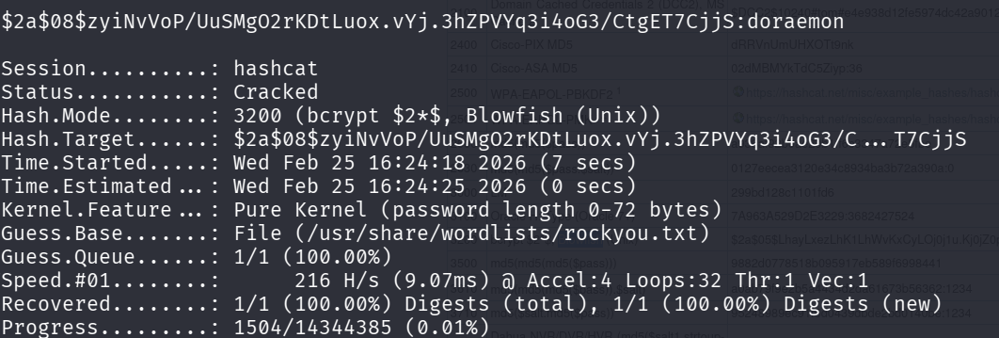

With her password, I immediately tried SSHing inside with it, but it didn't work.
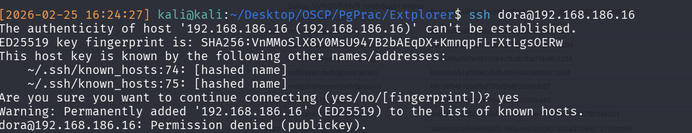

So just `su -u dora` with the password and you'll become dora!

## Privilege Escalation - Root
To priviilege escalate, again run `linpeas.sh`. Of course you can do this manually, but I usually just download `linpeas_fat.sh` onto victim and use the WC while I wait for the results. 

After a while, check through the results. Here's what I found copied pasted from my scratch which are potential vectors based on my experience. **It's important to NOTE DOWN EVERYTHING POSSIBLE FIRST. You can rank them based on feasibility after that, but note everything down first to avoid biases!**

|Finding|Feasibility|
|------|------|
|sudo version 1.8.31|Unlikely, www-data cannot sudoedit|
|CVE-2021-3560|Good 2 try|
|Something on localhost:53|Not accessible|
|PkExec has SUID bit set + ver 0.105|Try this! Yes/No answer|
|dirty sock CVE-2019-7304|Check first, do this last|
|/usr/bin CVE-2002-1614|Do this last, likely won't work due to date|
|filesystem|Try this second, highlighted and this shouldn't be a default config|

Immediately checking snap's version for dirtysock, we realise that it won't work because Snap must be <2.37.1 but unfortunately, it's 2.58.3 on the victim

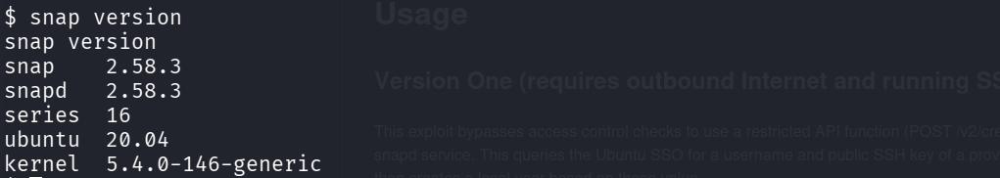

Next, I tried PkExec but unfortunately, did not get any success.

Therefore, we need to use the disk filesystem to privilege escalation. A quick google search will tell you how to do it, but TLDR is that some file systems might be mistakenly mounted on the root file path. Therefore if you can access it, you can access, well, the root file path which is a misconfig since like, that's pointless.

`df -h` throws up quite a few filesystems. Remember that we want to access one from root, so choose the one that is closest to root as possible, which in this case, it's nicely marked for us as the first one `/` at  `/dev/mapper...`

Therefore, just use it with `debugfs` and we've entered the root filesystem!

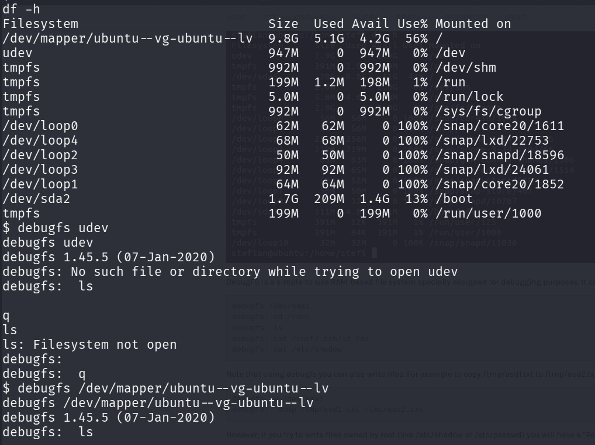

That's it!

Remember, if you're uncertain, just throw the entire search term into Google and read. That's how I learnt how to priv-esc via the debugfs mount.