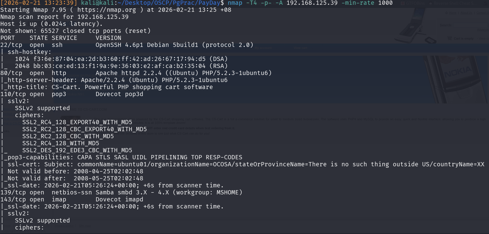
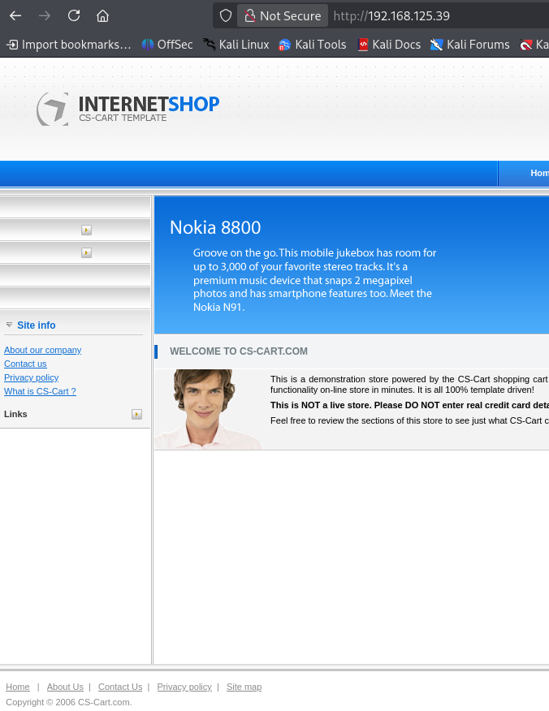
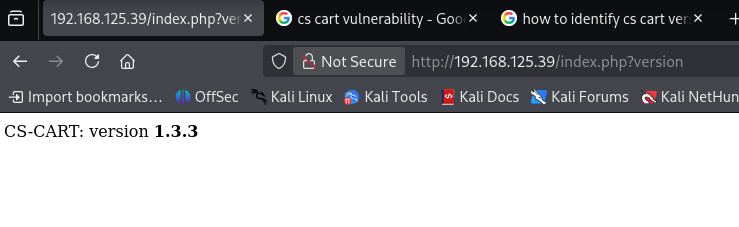
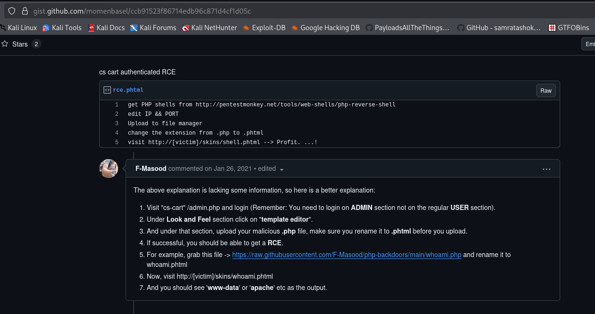
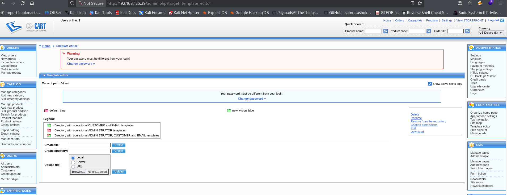
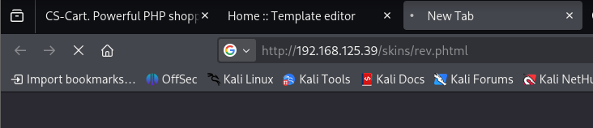
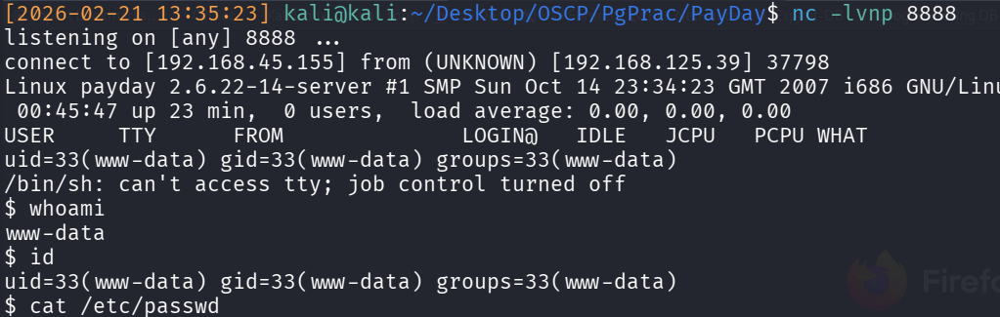
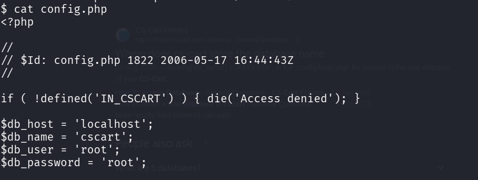
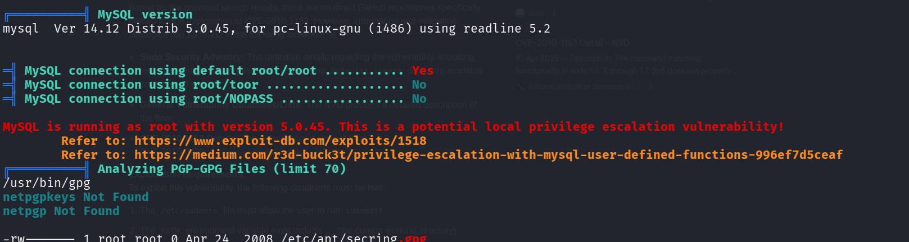
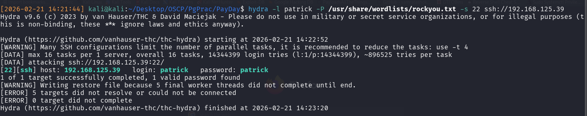

## Introduction
Following Lain Kusanagi's OSCP list, here's the writeup for PG Prac, Payday 💰.

## Enumeration
As per usual, run the nmap scan before doing anything: `nmap -T4 -p- -A 192.168.125.39 -min-rate 1000`

The nmap scan showed the following results:

|Ports|Services|
|-----|--------|
|22|SSH|
|80|HTTP Apache 2.2.4 + PHP site|
|110|Dovecot pop3d|
|130/445|SMB|
|143/993/995|Dovecot|

As per usual, don't attack SSH without known credentials. 
SMB was enumerated using `enum4linux`, but nothing worthwhile was thrown up. 
110, 143, 995, and 995 will likely not hold any worthwhile information and therefore, aren't worth checking. 

Therefore, visit the PHP site on port 80!

This reveals an Internet Shop with the CS-Cart Template.

Armed with a template, we can *technically* just google CS-Cart Vulnerabilities and try anything we see. But instead of trying an approach of throwing whatever sticks against the wall we should instead try a more *elegant* approach.

Googling `how to identify CS-Cart Version`, we find mention of a `?version` parameter, which when we use, reveal that it's CSCart 1.3.3.

Armed with this knowledge, we can google for `CS Cart Version 1.3.3 vulnerabilities` where eventually we'll stumble upon a mention of `Authenticated CS Cart RCE`. The original Github Gist which you'll discover is scant on details. However, after further research, I found a followup Github Gist which went into far greater detail.

As per the Gist, we need 2 items:
1) ADMIN access 
2) `.php` shell (which we'll rename to `.phtml` extension)

The other steps are follow-ups from accessing the web portal, so we can just follow those instructions. 

The `.php` shell can be easily settled, just use the `php-reverse-shell.php` from `laudanum` and edit with the relevant listener and port.

However, admin access is required. Normally you would run a ferox and whack out all the directories. However in this case, I instinctively tried `/admin` first since it's a logical assumption and am met with login page. Trying default credentials `admin:admin`, we successfully enter the webportal.

## Initial Access
Following the instructions from the Gist: 'Look and Feel' > template-editor, we can upload files. Copying and using laudanum's PHP reverse shell, and renaming the extension to `.phtml`, we can see that the upload is successful. Thereafter, set up a listener and visit the URL to catch the reverse shell.

Once we enter, we realise that we're `www-data`. Therefore we immediately `cat /etc/passwd` and see two other relevant users: `patrick` and `root`. We can now set our short-term goal: Privilege escalation to patrick first, then privilege escalation to root.

**To confess, I cannot recall if I could dump out the flag as www-data. But regardless, it's alwasys the intended path to privilege escalation via root. Additionally based on my understanding, most of the time initial access is supposed to be done as the user present in /home, else it's a misconfig.**

## Privilege Escalation- Patrick
If unsure, immediately run `linpeas.sh`. In this case, prior to running linpeas, I had already dumped the `config.php` of CS-cart, but there was nothing inside.

LinPeas threw up quite a few interesting findings, such as the `sudo` version being really old (1.6.8) and MySQL being 5.0.45 and therefore privilege escalatable via User Defined Functions. 

With the absence of good leads, I ran a brute force hydra against SSH using `patrick` since we do have the username of one user, whilst downloading `linpeas_fat.sh`. 
`hydra -l patrick -P /usr/share/wordlists/rockyou.txt -s 22 ssh://192.168.125.39`, with `-s 22` specified as a precaution for port indication. 


It's my opinion that the linpeas run should always be the fat version. When I did this box, I had always been running the slimmer version of PEAS because it's faster. However most of the time on HTB machines, I eventually had to run my own additional checks, which would have been initially run via fatpeas. So you might as well run fatpeas first and go take a break.


Hydra returned a successful match for `patrick:patrick`!

## Privilege Escalation- Root
After entering, I copied fatpeas and ran it again. This time, another finding popped out: Patrick could run all commands via `sudo`, and shown when `sudo -l`

Therfore this now becomes trivial. You can immediately do `sudo sudo /bin/bash` to spawn as root. Alternatively, just do `sudo ls -la /root` and then `sudo cat /root/flag.txt` and you're done.

This is a very common real step because the security assumption is that nobody will never be able to gain local access as any user since it's well protected. Therefore, system/application admins will often give their user account administrator level permissions! (Even I do so in my own environment unfortunately...)

And you're done!