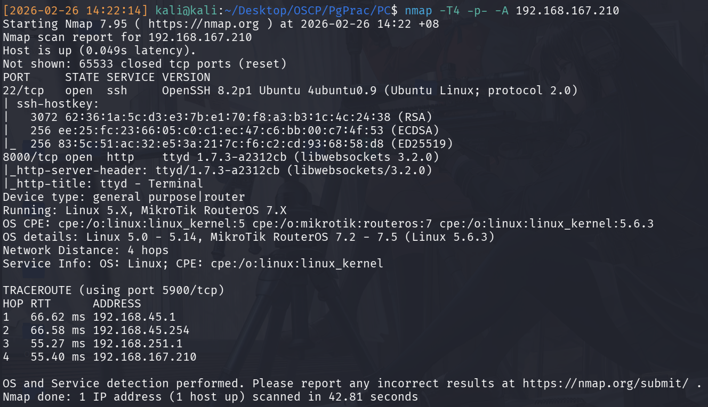
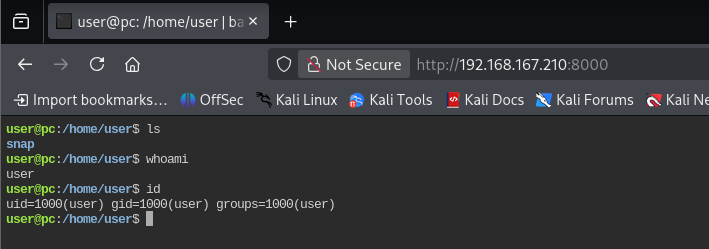
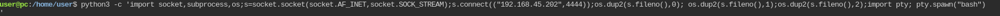
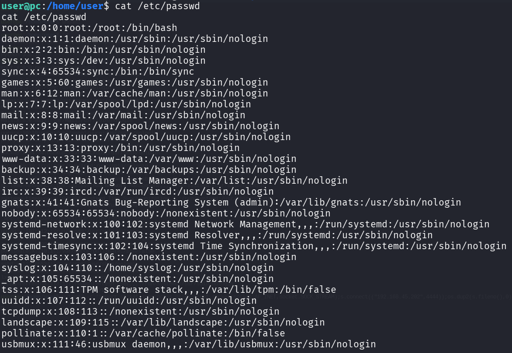

## Introduction
Following Lain Kusanagi's OSCP list, here's the writeup for PG Practice, PC. 

## Enumeration
As per usual, the first thing to do is an nmap scan: `nmap -T4 -p- -A 192.168.167.210 -oN nmap.txt`
The results of the nmap scan are as listed below:

|Port|Service|
|-----|------|
|22|SSH 8.2|
|8000|HTTP|

With only 2 services, the only obvious one to check is the HTTTP server at 8000 because of a lack of credentials for any meaningful SSH exploitation on port 22. 

Upon looking at the site, and poking around, we notice a web-console. And surprisinly, we can interact with it and issue linux commands. We can see that we are able to execute shell commands as user with uid of 1000. 

Therefore, checking that it has python, we can just execute a simple reverse shell and catch the listener on our attacker for an easier time to enumerate.

## Initial Access
With initial access as UID 1000, we can set out immediate goal to be becoming root. I confirmed this via `cat /etc/passwd`, which showed the next user `root`.

As per usual, if uncertain, execute `linpeas_fat.sh` immediately rather than fumble around and waste precious seconds. 

## Privilege Escalation