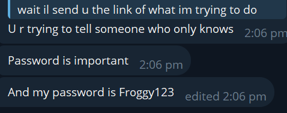

---
title: "What's NTLM?"
date: "2026-05-29T16:00:00+08:00"
publishDate: "2026-05-31T16:00:00+08:00"
lastmod: "2026-05-08T00:00:00+08:00"
description: "What's NTLM?"
draft: false
tags: ["NTLM", "Notes"]
--- 
## Foreword
Before I write this, the purpose of this post honestly is to first, remind myself what the purpose of NTLM is, and what's the process. It's more of a notes kind of thing. 

## Background
NTLM or Network Lan Manager 
NTLMv2 is a challenge-response authentication protocol that is used in Windows. It can be used to *authenticate users and computers in a Windows domain, or on stand-alone systems*. 

NTLM credsentials are based on data obtained during logon and consist of a 
- Domain Name
- User Name
- Hash (Note that by definition, hashing is a one way process hence stating it's a one-way hash is superfluous. This is because hashing involves putting an input into a mathematical function to generate an output which shouldn't be reversed as if it's reversed, it defeats the point of hashing as that's now encoding, which provides 0 cryptographic strength.)

NTLM authentication can either be interactive or non-interactive. 
Interactive involves a client system where the user requests authentication, and a DC, where info related to the user password is kept.
Noninteractive auth involves a logged-ion user accessing a resource such as a server application, typically involving a client, server and a DC that does the authentication calculations on behalf of the server. 

In a typical workflow:
1) User sends request with domain name, username, password. A hash is computed **and the password is discarded**.
2) This hash is sent in the first request **in plaintext**.
3) Server generates 8 byte random number (nonce), sends it to client. **The nonce must be unique!!!**
4) Client encrypts this nonce with the hash of user password, returns this to the server as the response.
5) Server sends Username, Challenge, Nonce to DC. 
6) DC uses username to retrieve user password from **SAM**, using the password hash to encrypt the challenge
7) DC compares encrypted challenge it computed with response computed by client. If it's ok, auth is ok!

### NTLM vs NTLMv2
There's actually a distinction between NTLM and NTLMv2. Although the term in the background was used interchangeably.
NTHash is what Windows stores hashes locally as: LM-Hash and NT-Hash. 
NTLMv2 is the **authentication protocol**. 

## Attacks ⚔️
Generally an attack in a Red-Team engagement/CTF would involves setting up a listener, and convincing people to authenticate against the machine, either via a protocol (for a CTF, such as Remote File Inclusion), or a phishing link.
This exploits part 1 and 2 of the workflow, and with the captured hash, just brute-force it. Relying on the usual `rockyou.txt` wordlist will be outdated, although people do still use the password surprisingly...

Note that this person has a Masters. 

Alternatively, you could set up a MITM relay, and act as a middle-man in the communication between client and server, just relaying requests back and forth. 

## Tools to Use
It's generally `responder` or Impacket's SMBServer. 

## References
1. Microsoft. (n.d.). Microsoft NTLM - win32 apps. Win32 apps | Microsoft Learn. https://learn.microsoft.com/en-us/windows/win32/secauthn/microsoft-ntlm?redirectedfrom=MSDN 