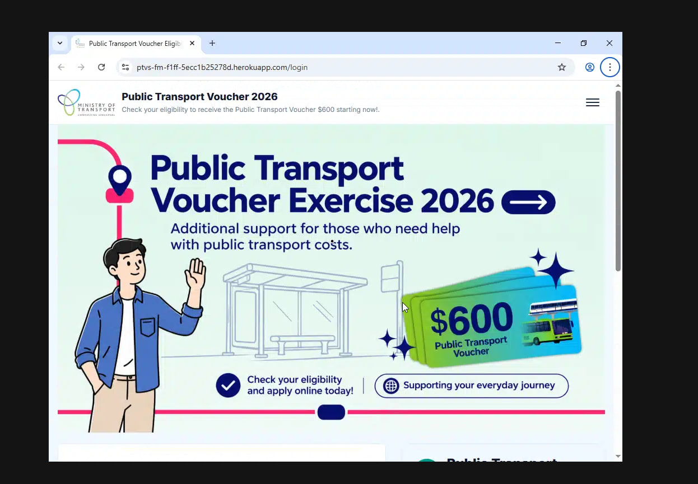
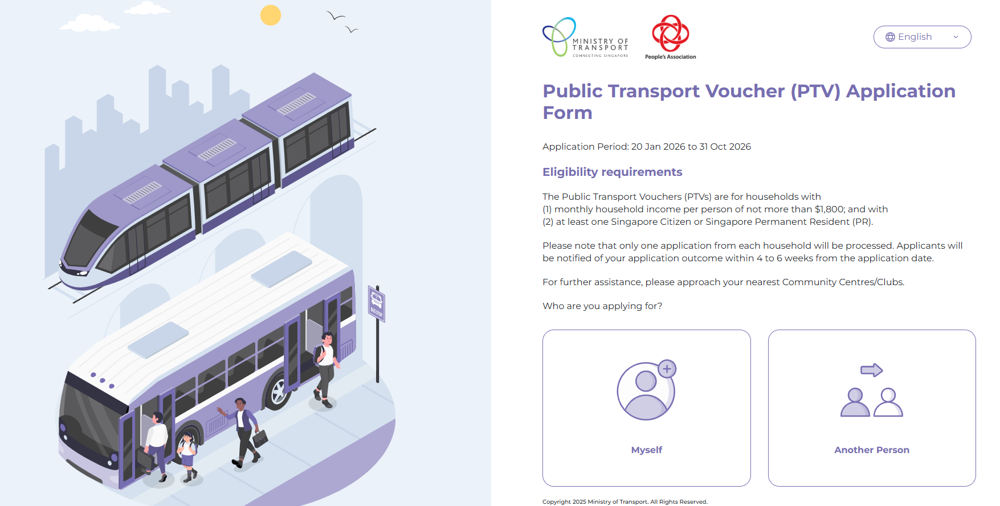
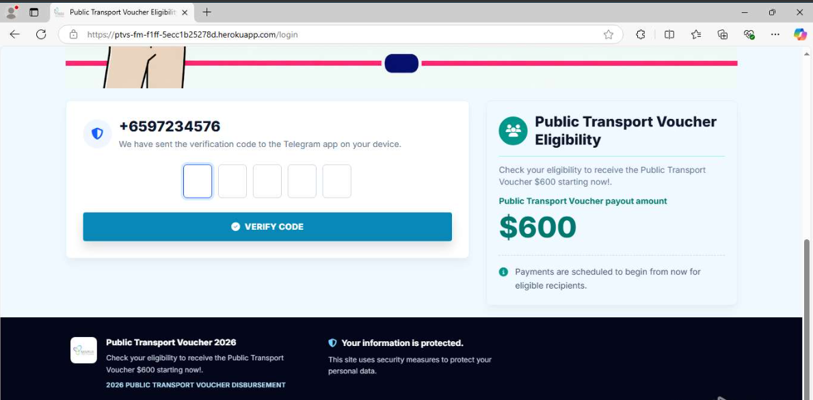
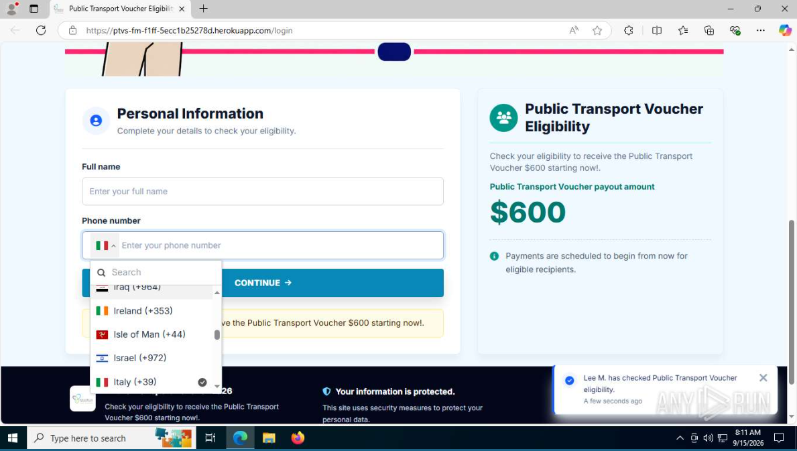
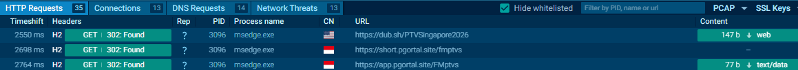
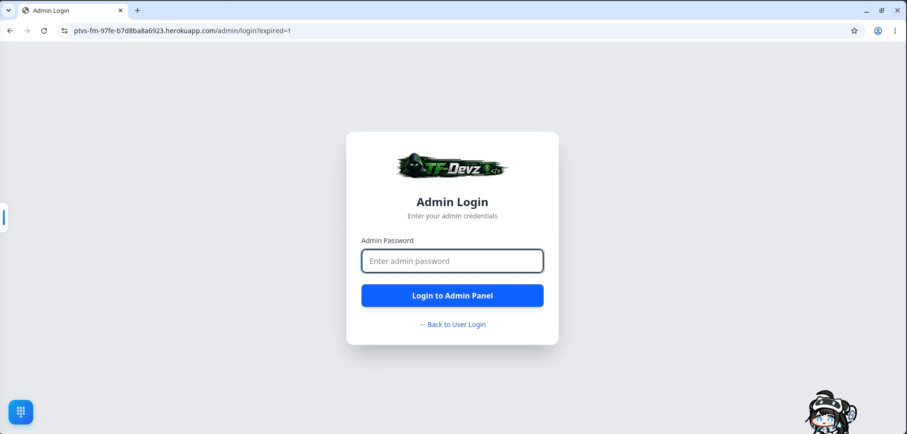
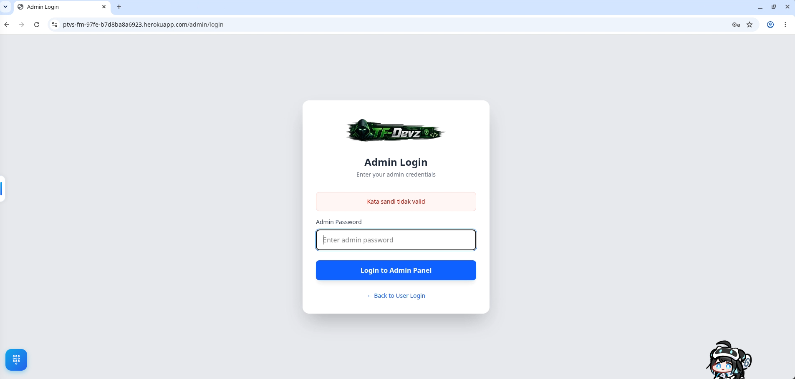

---
title: "A Brief Threat Hunt"
date: "2026-09-17T11:40:00+08:00"
publishDate: "2026-09-17T11:40:00+08:00"
description: "A brief + noninvasive Threat Hunt"
draft: false
tags: ["Phishing Message", "ThreatHunt", "Telegram"]
--- 
## Background
In the 3rd quarter of 2025, the Singapore Government (more specifically, the Ministry of Transport), rolled out the **Public Transport Voucher** initiative to help Singaporeans with the then-soon-to-rise cost of Public Transportation. In Singapore, Public Transport comprises of Bus, MRT (Akin to USA's subway), and LRT (Akin to Trams). These vouchers were not distributed to every Singaporean household, and were instead targeted towards ["resident households with monthly household income per person of not more than $1,800, as part of the 2025 PTV Exercise"](https://www.mot.gov.sg/what-we-do/public-transport/public-transport-vouchers/).


Note that when interacting with a malicious site, always use sandboxes for caution. Also, comply with all local regulations and laws regarding site interacting, erring on the side of caution. For example, in Singapore, the Computer Miuse Acts also covers unauthorized interaction with foreign computer systems. Hence, self-initiated threat hunts must only cover non invasive techniques. 


## The Phish
Recently, a Telegram Credential Stealer has surfaced, with the landing page of the site targeting this very scam. 

From my understanding, this page was the first few iterations of the site itself. It's been changed substantially now. 

Browsing through the single-paged web app, the site will ask victims to enter their full name and handphone number, after which a telegram OTP will be sent. Should the victim also send the Telegram OTP, their Telegram account will be hijacked, allowing for browsing of all sent messages, and also further profileration of this phishing message to all other groups. Additionally, should the victim have saved crucial login details in their "Saved Messages" self-chat, the attacker would have easily scored a win and can further their reach into the victim's personal environment. 

To add legitimacy to the site, there's a toast that comes up every 5 or so seconds which shows fake users successfully claiming their vouchers. **The idea is to instill a sense of fake urgency into victims to quickly enter their details without much thought**.

## Further Exploration
By viewing the site in `any.run`, we can see that it also makes GET requests to an IP based in Indonesia, along with the URL `hxxps[://]short[.]pgortal[.]site/fmptvs`, for example.

`short` is a URL shortener, presumably to hide the origins of the malicious site. 

However, should we change the directory of the phishing site itself to `/admin`, we can view an administrator login endpoint instead. 

Attempting a simple password of `admin` does not yield valid credentials. However, we do get an instructive error message. 

>[!NOTE]
>Ignore the anime girl, that's just my own Desktop avatar pet running around the screen to stave away boredom 😅

## Analysis
Many signs indicate that this is an unsophisticated threat actor, very likely utilising Phishing As A Service services. 

1) Although a toast with fake users pop ups, the original Heroku site URL is just copied straight off Heroku's hosted platform itself. No domain was bought and registered, and linked to the site. 
2) The threat actor is using an older version of the site, ignoring the fact that for official Singapore sites which require entering of personal information, SingPass (Singapore's official 2FA Solution) is mandatory. 
3) Clicking the burger icon yields nothing. A sophisticated threat actor would have likely linked it to another page to add legitimacy in case a victim wants to access other functionality from this page. For example, the attacker could have linked it to the official site from the burger icon. 
4) No reverse proxy was enabled. Browsing to the `/admin` endpoint is definitely a no go since in a proper authorised engagement, this is an attack vector and threat hunters would definitely zero-in on this target, either utilising a wordlist to spam logins, research on vulnerable libraries to enter, or further browse for config files etc. A proper threat actor would scope access to only the scam page to reduce attack surface area. 

## Learning Points
Don't click funny links. 