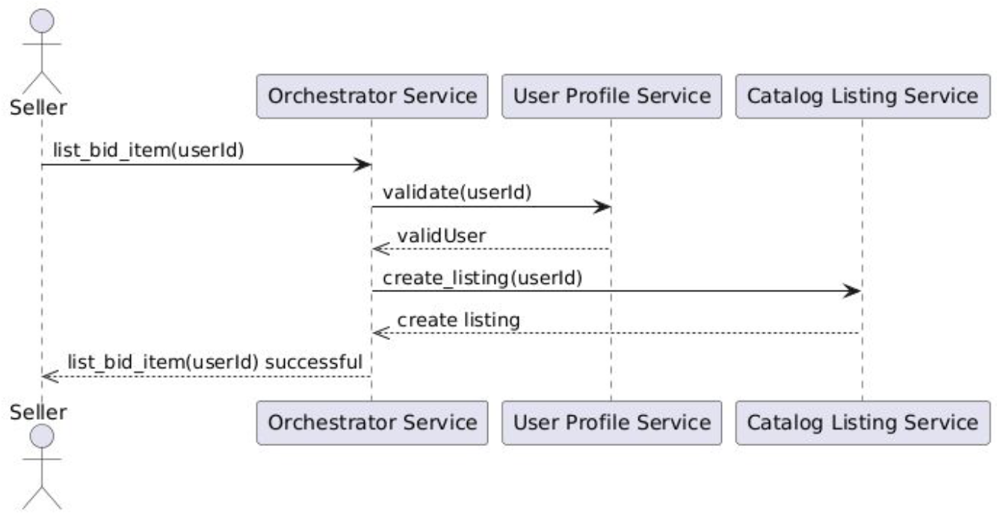
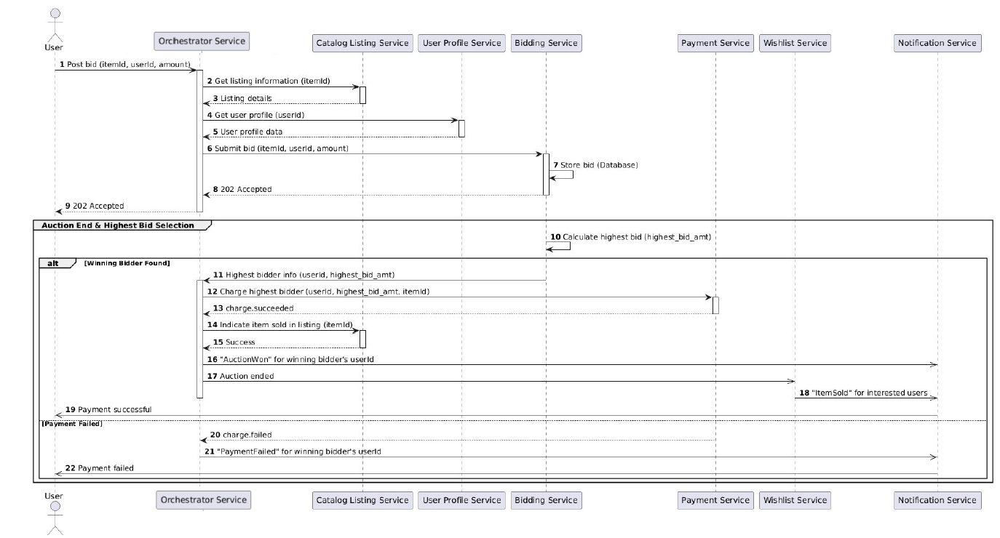
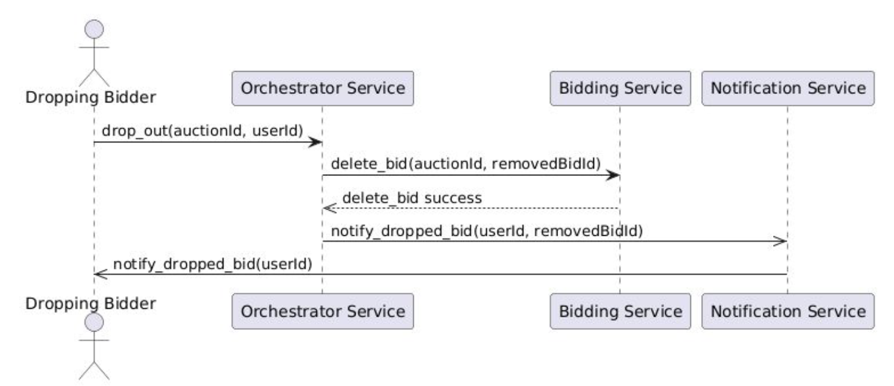
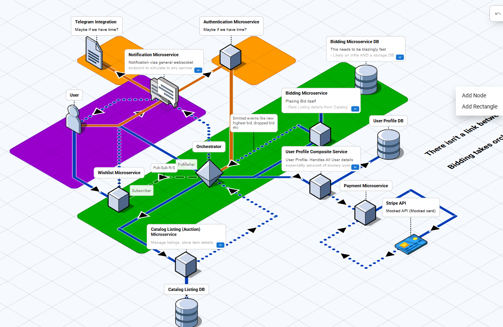
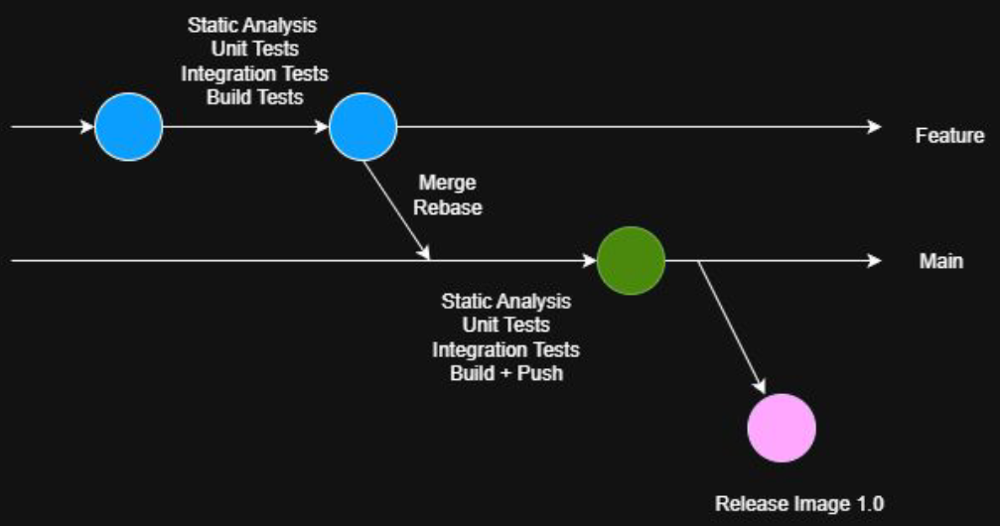

## Introduction
As stated in the title, the aim of the module was to teach about DevOps. A quick summary would be the various mindsets, tools, and approaches used by DevOps Engineers to bridge the gap between Developers and Operations, instead of the typical isolated silos being constructed between Developers, Operations, and Security, resulting in among other things, poor deliverable handoffs and overall poor coordination.
For example, a typical silo problem would be that developers would make an application, say in Python or Java. This usually will require external dependencies, either imported or installed into system, and the development environment, the Java Compiler Version, the Springboot Version, and/or the Python Version. However, this is not communicated effectively to Operations. As a result, when they clone the repo, all they get is the source code and when run, obviously does not work, throwing errors such as "Missing Dependency" or "(Module) incompatible with the current Python version". On an organisational level, this increases the time to market of the app, and without needing a business major to tell you, this can lead to customer churn simply because you can't market your app as fast as possible. More importantly, on a personal level, this leads to alot of user frustration and angst because essentially, this is just extremely annoying because **no productive work is being done, and precious time and effort is spent on fixing useless installation errors**. 

*Therefore primarily, DevOps aims to communicate methods and mindsets to bridge this gap*.

## Project Introduction
Enough about DevOps. I'll introduce the requirements of the project first. 

### ⚒️TrueHammer⚒️
The overall goal was to "prototype a microservices-based application that solves a problem of your choice" by utilising modern DevOps tools and practices, replete with a full CI/CD chain on Gitlab🦊

The major requirements included:
1) At least 3 key scenarios addressing the identified problem
2) Consists of at least 4 microservices, developed using at least two different languages 
3) Implement CI/CD for every service
4) Implement at least 1 microservices communication pattern
5) Utilise HTTP and message based communication
6) Automatically Deployable via Docker locally (simulating test environment), and remotely (simulating prod environment)

### Chosen Topic
The topic chosen was a Bidding Website (Similar to Ebay). Specifically, we implemented a **First Place Sealed Bid** Bidding system to resolve the issue of how bids would be sniped by bots. 
Our 3 Scenarios were:

1) Seller creates a listing

2) Multiple bidders (Let n = num bidders. In this case, n > 2), highest bid amongst the bids is picked as the winning bid

3) Highest bidder withdraws their bid from the auction

### Architecture
The overall Architecture diagram is as shown:

As you can tell, we chose the Orchestrator Service pattern. The primary reason was this was because of our scenario. As a bidding website, we wanted as many ACID transactions as possible, and valued as much insight as possible into every stage of the sequences. Therefore, orchestrator pattern would allow for this benefits due to constant communication with the orchestrator, allowing us to log transaction progress. This was in contrast to the other Choreography and Saga Patterns, which primarly didn't have much transaction progress by design.

For simplicity, we implemented Python for most of the microservices. However, for a minority of the services, Go was used.

By the way, shout out to FossFlow on Github. I use it all the time to make the Isometric Architecture Diagrams, since it beats looking at it from a 2D perspective.


### CI Practices

#### Trunk Based Development
We avoided pushing to main, instead opting for two trunks (Feature and Main). The 'Main' trunk was our evergreen, ready-to-deploy trunk, **reflecting Continuous Delivery** (since the difference between the two is Deployment refers to automatic deployment, while delivery is everything up till deployment, with the option of pushing to production being a manual decision- such as to time with campaigns etc).

One thing to note is that we had an extra custom stage- "Build Tests".
This was separate from the usual stages we had: Static Analysis, Unit Tests, Integration Tests, and E2E Tests.

|Stages|Details|
|-----|-----|
|Static Analysis|Implemented Static Analysis using flake8 for Code Linting according to PEP8 guidelines/standard GO templating. Additionally, Pylint was used to further detect bad code smell.|
|Unit Testing|Pytest and GO's Testing Framework was used. Source Code Logic was evaluated at this stage. For the few dependencies that were involved with Source Code, they were stubbed to give canned answers for assertion.|
|Integration Testing|Pytest and GO's Testing Framework was used. This time, dependencies were initiliased at testtime using Docker and their various init scripts, such as `sql.init`.|
|**Build Tests**|As I mentioned, we practiced Trunk Based Development. However, due to a lack of time, our initial API contract had to be appended to on the fly constantly. Therefore, this meant that the Docker Images kept changing (and consequently kept breaking since for example, our file directories would change). However, to build in E2E Tests would be too late as well, instead of verifying overall logic, we were debugging Docker Build Errors. Therefore, we implemented Build Tests. As the final stage of testing run on Feature Branches, and also merges to Main, this stage just involved building the relevant microservice Docker Image on Gitlab's DID infrastructure. After that, nothing was done- this image was never pushed anywhere. It was just built, tagged, and discarded. This allowed us to know that the Docker Image could be built successfully (and therefore any errors would be code logic, not build logic).|
|E2E Tests|Our E2E Tests were run in staging environment, and only had 3 tests, simulating the various pathways in our sequence diagrams (as that was the main focus of the project).|

#### Test Driven Development (TDD)
We followed the philosophy of TDD as much as possible. The aim was to ensure that tests were comprehensive, so a failing test was intentionally written first, and code was made to pass it. This allowed us to in the future, modify our source code and know that our tests would cover most, if not all, of our requirements because we had written the tests first. 

#### Tool Choices
As mentioned, we use Pylint, Flake8, and GoFMT for the microservices. For the frontend, we used Prettier and EsLint during Static Analysis. 

For Unit Tests/Integration Tests, we used Docker, Pytest, and Go again, along with Gitlab's Docker In Docker infrastructure. One thing that we used surprisingly consistently was [MutMut(https://mutmut.readthedocs.io/en/latest/index.html)] for Mutation Testing. This was because we could easily write boundary tests for input. However, to use a mathematical analogy, the input range is far larger than the output range. Therefore, we conceivably could not write unit and integration tests to cover all types of different input- benign or malformed. Mutation Testing was used to bridge this gap to help provide varied inputs during testing and at least attempt to have varied test inputs. 

During E2E Tests, we used additionally Chaos Mesh and ArgoCD. ArgoCD to automate the Kubernetes (K8s) testing portion since clicking buttons and looking at GUI's is far easier than writing `kubectl apply -f` a thousand times, and can even be a through process to achieve Continous Deployment. Chaos Mesh was used to simulate production environment instability, by examining whether our microservices could recover and had any production bugs not caught in tests. 

**Chaos Mesh was an extremely good choice on hindsight**. This is because during the final stages of our project, there was actually a production bug in the Payment Microservice. The Payment Microservice had too short a health-check duration in the K8s Manifest file because the associated Database took longer than expected to initialise due to having more data. As a result, although Payment would successfully spin up the first time, if Payment Microservice was automatically terminated by Kubernetes due to failing a health check, the subsequent spin-ups would fail, crashing the entire payment user flow. Chaos Mesh helped pick this up because the graphs kept showing how payment would never recover despite being killed. 

For Telemetry and Monitoring, the usual Grafana and Prometheus combination was used via the typical exposure of /metrics, and Prometheus pulling said metrics to itself for aggregation and statistical analysis. 

### My Contributions
My contributions involved 
1) Creation of the entire UserProfile Microservice
2) Initial Creation of 3 User Diagrams
3) Partial Implementation of the staging and production K8s Files and Environment
4) Research, Implementation and Usage of Chaos Mesh and ArgoCD

## Learning Points
DevOps was an eye-opener (Especially since I interact quite a bit with Docker for CTFs, but not much of the entire Development Process). It was enlightening to see how the entire process from `git push` to `ready in prod` could be automated and reliable. This definitely influnced me in my other projects, as I faced the usual antipatterns of Monolith Development (Big Ball of Mud causing my entire service to be too tightly coupled, making 1 change affect 10 other functions). Feel free to check it out here:



With that said, writing tests is definitely the most painful part. The second most painful part would be troubleshooting communication between microservices. And honestly, I hope I don't sucuumb to the Fairy Pixie Dust issue where I think that microservices would solve my Monolith issue, when it's a ground up source-code system design problem. 